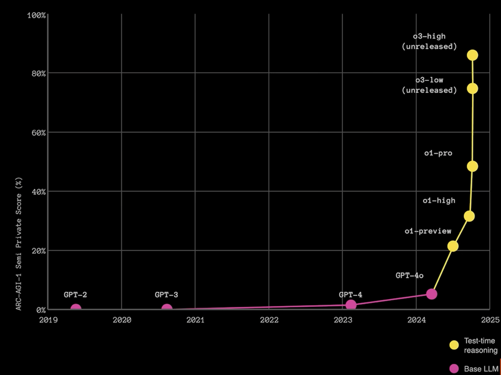
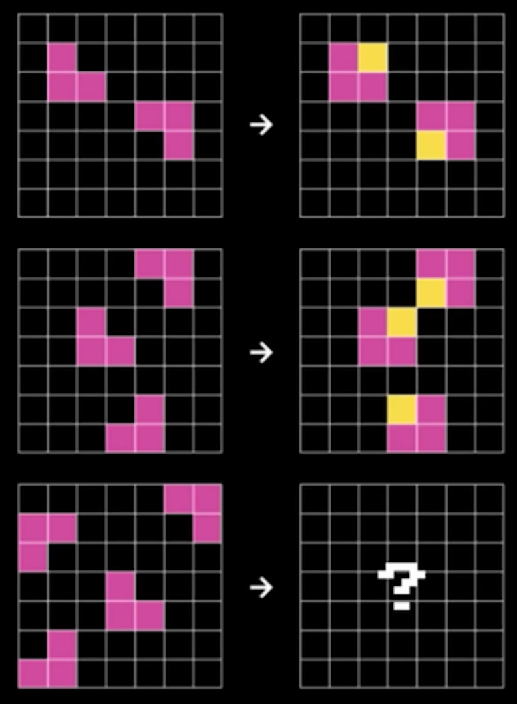
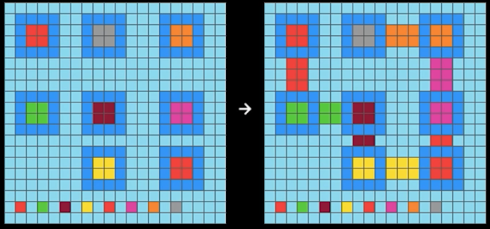

# The ARC Challenge: A Strategic Lens on AI's Current Limitations

ARC stands for the "Abstract Reasoning Corpus".  It is an AI benchmark that revals the limitation of many large-langauge models.

## Introduction: Why a Simple Test Reveals Profound Truths About AI

Imagine asking a five-year-old child to look at a simple pattern of colored squares and then complete a similar pattern with slight variations. Most children can do this easily after seeing just one or two examples. Now imagine that the world's most sophisticated AI systems—the same ones that can write poetry, code software, and analyze complex documents—struggle with these same simple visual puzzles that children master effortlessly.

This is the reality revealed by the Abstraction and Reasoning Corpus (ARC) Challenge, a deceptively simple test that has become one of the most important benchmarks for understanding the true capabilities and limitations of artificial intelligence. For strategic planning teams evaluating AI investments and transformation initiatives, the ARC Challenge offers crucial insights into what AI can and cannot do—and why this matters for your organization's future.

## What is the ARC Challenge?

 
ARC 1 Example.

The ARC Challenge, created by AI researcher François Chollet in 2019, consists of 1,000 simple visual puzzles. Each puzzle shows a few examples of input grids (typically 3x3 to 30x30 colored squares) paired with corresponding output grids. The test-taker—whether human or AI—must identify the underlying rule or pattern and apply it to solve new, unseen variations.

These puzzles might involve:

- Rotating or reflecting shapes
- Counting objects and applying arithmetic
- Identifying symmetries or completing patterns
- Understanding spatial relationships
- Applying logical rules consistently across variations

The key insight is that these tasks require what researchers call "fluid intelligence"—the ability to think abstractly, identify patterns, and apply learned concepts to novel situations. This is fundamentally different from the pattern recognition that current AI excels at.

## The Humbling Results: Where AI Falls Short

) 
ARC 2 Example

The results of the ARC Challenge reveal a striking gap between human and artificial intelligence:

- **Average humans**: Achieve approximately 80% accuracy
- **State-of-the-art AI systems** (as of 2024): Achieve less than 30% accuracy
- **Large Language Models**: Typically perform worse than 20%

Even more telling, humans can often solve these puzzles with just one or two examples, while AI systems require massive amounts of training data and still fail to generalize effectively. This performance gap persists despite the fact that these same AI systems can outperform humans in many other domains, from playing chess to generating coherent text.

## Why This Matters: Understanding vs. Pattern Matching

The ARC Challenge illuminates a fundamental distinction that strategic leaders must understand: the difference between sophisticated pattern matching and genuine understanding.

### Current AI Strengths: Statistical Pattern Recognition

Modern AI systems, particularly Large Language Models (LLMs), excel at:

- Identifying statistical patterns in vast datasets
- Generating human-like text based on learned associations
- Performing complex classification and prediction tasks
- Processing and summarizing large volumes of information

### The ARC Gap: Abstract Reasoning and True Understanding

However, the ARC Challenge reveals that these systems struggle with:

- **Abstraction**: Identifying the essential, generalizable principles underlying specific examples
- **Reasoning**: Applying logical rules consistently to novel situations
- **Efficiency**: Learning new concepts from minimal examples
- **Flexibility**: Adapting learned principles to unfamiliar contexts

This distinction has profound implications for how organizations should think about AI deployment and expectations.

## Strategic Implications for Organizations

### 1. Realistic Capability Assessment

The ARC Challenge results suggest that organizations should approach AI implementation with clear-eyed realism about current limitations. While AI can dramatically enhance productivity in pattern recognition tasks, it may struggle with:

- Novel problem-solving that requires true reasoning
- Adapting to new situations that weren't represented in training data
- Making decisions that require understanding of underlying principles rather than surface patterns

### 2. Human-AI Collaboration Models

Rather than viewing AI as a replacement for human intelligence, the ARC Challenge points toward complementary strengths:

- **AI Excellence**: Processing large datasets, identifying statistical patterns, automating routine decisions
- **Human Excellence**: Abstract reasoning, learning from few examples, adapting to novel situations, understanding context and meaning

Strategic AI implementations should leverage these complementary capabilities rather than assuming AI can replicate human reasoning.

### 3. Risk Management and Oversight

The ARC Challenge highlights why human oversight remains critical in AI systems, particularly for:

- **High-stakes decisions**: Where abstract reasoning and contextual understanding are crucial
- **Novel situations**: Where the AI system encounters scenarios outside its training distribution
- **Ethical considerations**: Where understanding principles and values, not just patterns, drives appropriate action

### 4. Investment Priorities and Timeline Planning

Understanding AI's current limitations helps organizations make more informed decisions about:

- **Short-term investments**: Focus on areas where pattern recognition and automation provide clear value
- **Long-term planning**: Recognize that human expertise will remain essential for complex reasoning tasks
- **Training and development**: Invest in building AI literacy while maintaining and developing human capabilities that complement AI strengths

## The Broader Context: Limitations of Current AI Paradigms

The ARC Challenge connects to broader discussions about the limitations of current AI approaches that strategic leaders should understand:

### The LLM Limitation

As noted in recent research and industry discussions, current Large Language Models fundamentally:

- Lack world models that represent how things actually work
- Cannot perform genuine causal reasoning
- Struggle with systematic generalization to new domains
- Often produce confident-sounding but incorrect responses

### The Need for Hybrid Approaches

Leading AI researchers increasingly advocate for hybrid systems that combine:

- **Neural networks** for pattern recognition and learned associations
- **Symbolic reasoning** for logical operations and rule application
- **World models** that represent how the physical and social world actually operates

The ARC Challenge demonstrates why such hybrid approaches may be necessary for achieving more robust AI capabilities.

## Practical Applications for Strategic Planning

### Scenario Planning Exercise

Consider how your organization would handle these scenarios, given current AI limitations revealed by the ARC Challenge:

1. **Crisis Response**: When facing an unprecedented situation, can your AI systems adapt their recommendations, or will they default to patterns from past data that may not apply?

2. **Innovation Strategy**: For developing new products or entering new markets, how will you balance AI-driven insights with human creativity and reasoning?

3. **Regulatory Compliance**: As regulations evolve, can your AI systems understand new requirements, or will human interpretation and adaptation remain essential?

### Building Organizational Resilience

The ARC Challenge suggests that resilient organizations will:

- Maintain strong human capabilities in reasoning and adaptation
- Design AI systems with clear limitations and human oversight
- Invest in training that helps humans work effectively with AI tools
- Develop decision-making processes that combine AI efficiency with human judgment

## Looking Forward: What the ARC Challenge Tells Us About AI's Future

### The Path to More Capable AI

Progress on the ARC Challenge may signal breakthroughs toward more general AI capabilities. Organizations should monitor:

- Research into hybrid neural-symbolic systems
- Advances in few-shot learning and generalization
- Development of AI systems with better world models
- Progress toward AI that can reason about causation, not just correlation

### Strategic Patience and Preparation

The persistent difficulty of the ARC Challenge suggests that truly general AI—systems that can reason and adapt like humans—may still be years or decades away. This timeline has strategic implications:

- **Immediate focus**: Maximize value from current AI capabilities while maintaining human expertise
- **Medium-term planning**: Prepare for more capable AI while not over-investing in anticipation of breakthroughs that may not materialize quickly
- **Long-term strategy**: Build adaptive organizational capabilities that can evolve with AI advancement

## Conclusion: The ARC Challenge as Strategic Compass

The ARC Challenge offers strategic leaders a powerful tool for understanding AI's current reality rather than its marketing hype. By revealing the gap between pattern recognition and true reasoning, it helps organizations:

- Set realistic expectations for AI implementations
- Design effective human-AI collaboration models
- Make informed investment decisions
- Prepare for both current AI capabilities and future developments

As your organization navigates AI transformation, remember that the most successful strategies will be those that honestly assess both AI's remarkable strengths and its fundamental limitations. The ARC Challenge provides a clear benchmark for this assessment—a simple test that reveals profound truths about the current state of artificial intelligence and its implications for strategic planning.

The child who can effortlessly solve visual puzzles that stump our most sophisticated AI systems reminds us that intelligence involves more than pattern matching. Until AI systems can match human performance on the ARC Challenge, organizations must plan for a future where human reasoning and AI pattern recognition work together, each contributing their unique strengths to drive innovation and competitive advantage.

---

*For organizations interested in conducting their own ARC Challenge assessments or exploring the implications for their specific AI initiatives, consider establishing an AI evaluation framework that includes both technical benchmarks and strategic capability assessments aligned with your business objectives.*

## References

[YouTube Video](https://www.youtube.com/watch?v=5QcCeSsNRks)