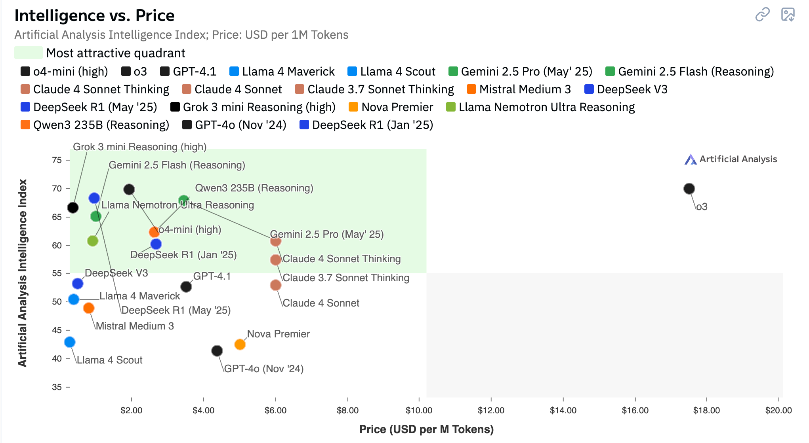

# AI LLM Intelligence vs. Price Analysis: Breaking the Linear Cost-Quality Assumption

[Artificial Analysis Website](https://artificialanalysis.ai/#intelligence-vs-price)

The relationship between artificial intelligence capabilities and pricing in Large Language Models reveals a fascinating economic landscape that defies simple linear expectations. While conventional wisdom suggests that smarter models command higher prices, the reality presents a more nuanced picture with significant strategic implications for organizations evaluating AI investments.

## The Price-Intelligence Paradox

Current market dynamics show that intelligence and cost don't always correlate as expected. Some models deliver exceptional reasoning capabilities at surprisingly competitive price points, while others charge premium rates for incremental improvements. This disparity creates opportunities for cost-conscious organizations to access sophisticated AI capabilities without proportional budget increases.

Consider the pricing spectrum per million tokens: entry-level models might cost $0.50, mid-tier options range from $3-8, while premium models can reach $30 or more. However, the intelligence gap between a $3 model and a $15 model often represents a smaller performance delta than the 5x price difference would suggest.

## Factors Driving Price-Performance Variations

**Model Architecture Efficiency**: Some organizations have optimized their architectures to deliver high-quality outputs with fewer computational resources, enabling competitive pricing despite strong performance.

**Market Positioning Strategy**: Established players may price based on brand value and enterprise features rather than pure capability metrics, while newer entrants use aggressive pricing to gain market share.

**Infrastructure Economics**: Companies with proprietary hardware optimizations or efficient scaling can offer better price-performance ratios than those relying on standard cloud infrastructure.

**Training Data Quality**: Models trained on carefully curated, high-quality datasets may outperform larger models trained on vast but lower-quality data, despite requiring fewer resources to operate.

## Strategic Implications for Organizations

**Benchmark Beyond Headlines**: Organizations should conduct task-specific evaluations rather than relying on general capability rankings. A model that excels at your particular use case may cost significantly less than a "better" general-purpose alternative.

**Consider Total Cost of Ownership**: Price per token is just one factor. Models with larger context windows might process complex documents more efficiently, reducing total token consumption despite higher per-token costs.

**Evaluate Specialized vs. Generalist Models**: Domain-specific models often provide superior performance for targeted applications at lower costs than general-purpose flagship models.

## The Efficiency Frontier

The most compelling opportunities exist along the "efficiency frontier" – models that deliver maximum intelligence per dollar spent. These sweet spots often emerge from:

- Open-source models with optimized inference implementations
- Mid-tier offerings from major providers seeking market penetration
- Specialized models fine-tuned for specific domains
- Regional providers offering competitive alternatives

## Future Market Evolution

As the AI market matures, we expect to see greater price-performance standardization, but currently, significant arbitrage opportunities exist. Organizations that carefully evaluate their specific requirements against the full landscape of available models can achieve substantial cost savings while maintaining or even improving AI capabilities.

The key insight for decision-makers: intelligence and price correlation in the LLM market is far from perfect, creating opportunities for strategic advantage through careful model selection based on actual performance requirements rather than brand recognition or headline capabilities.