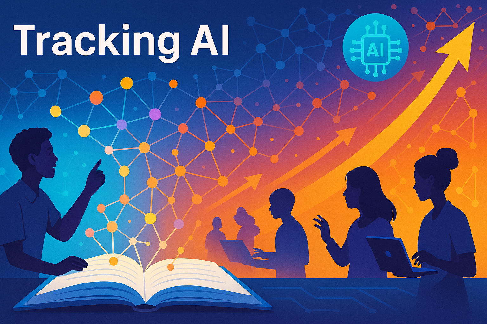

# Tracking Artificial Intelligence

<!--
Please generate a cover image for our new website on Tracking AI. 

Our goal is to make people aware that the exponential growth of AI capabilities will have a HUGE impact on education and knowledge management. Concept graphs with learning dependencies are key to building these intelligent textbooks.

Here is the welcome text:

Welcome to our website on tracking AI. We feel that the exponential growth of the capabilities of AI systems in the last 10 years will continue for the foreseeable future. Many organizations are not tracking the speed that AI systems are improving. The media is rife with misinformation about what AI can and can't do today and what new capabilities are on the near term horizon (under 10 years).

This course helps you understand these trends and helps you put decision frameworks in place to understand why you might want to invest in AI technologies.

-->

Welcome to our website on tracking AI.  We feel that the exponential growth of the capabilities of AI systems in the last 10 years will continue for the foreseeable future.  Many organizations are not tracking the speed that AI systems are improving.  The media is rife with misinformation about what AI can and can't do today and what new capabilities are on the near term horizon (under 10 years).

This course helps you understand these trends and helps you put decision frameworks in place
to understand why you might want to invest in AI technologies.

Please contact me on [LinkedIn](https://www.linkedin.com/in/danmccreary/) if you have any
specific questions I can help you with.

