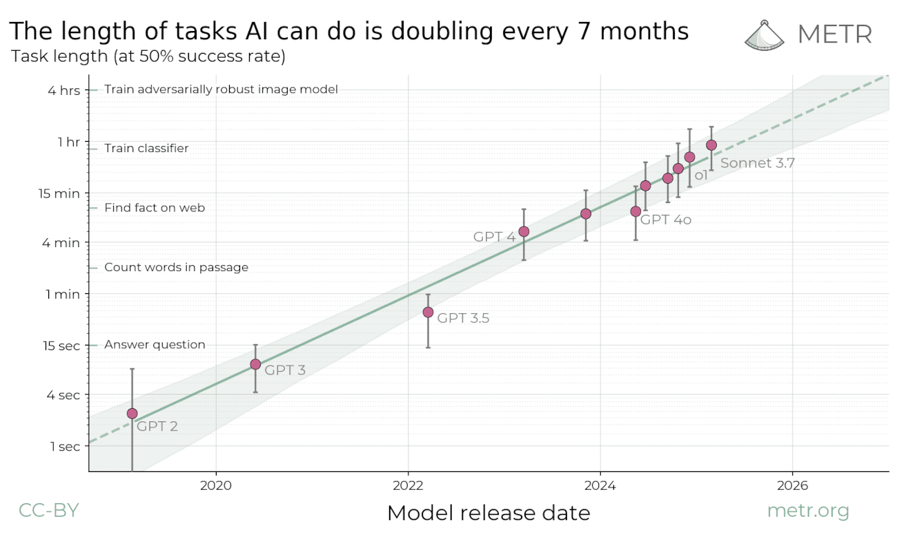

# AI Doubling Rate

The length of tasks (measured by how long they take human professionals) that generalist frontier model agents can complete autonomously with 50% reliability has been doubling approximately every seven months for the last six years. The shaded region represents 95% Confidence Interval calculated by hierarchical bootstrap over task families, tasks, and task attempts.

## AI’s Ability to Handle Long Tasks: What You Need to Know

**Summary of the March 2025 METR Report**

### Why This Matters

As artificial intelligence (AI) becomes more advanced, it’s not just about answering trivia questions or writing short emails anymore. A key question now is:
**Can AI complete long, complex tasks the way humans can—like writing software, planning events, or conducting research?**

The METR team has developed a new, easy-to-understand way to measure this:

> **How long a task (in human time) can today’s AI complete successfully?**

### What Did They Measure?

* METR looked at **170 real-world tasks** like fixing software bugs, writing reports, or planning multi-step actions.
* Each task was rated by how long it typically takes a **skilled human** to do it—from just a few minutes to several hours.
* Then they tested how well top AI systems performed those same tasks.

### What They Found

* Today’s best AI systems (like OpenAI’s and Anthropic’s) can **reliably complete tasks that take up to about an hour of human effort**.
* For very short tasks (under 5 minutes), AI is nearly perfect.
* But as tasks get longer and more complex—especially past 4 hours—AI still struggles.
* Most importantly: **the ability of AI to complete longer tasks is doubling roughly every 7 months**.

### Why This Trend Is Big News

If the current pace continues:

* In **2–3 years**, AI may handle tasks that take a human **a full week or more**.
* In **5 years**, it may independently manage **projects that currently take a team of people a month**.

This means AI could soon:

* Write complete software products
* Research and draft business strategies
* Conduct customer support or internal reporting workflows end-to-end

### ⚠️ Things to Keep in Mind

* A 50% success rate isn’t perfect. AI may still make mistakes or need supervision.
* These results are from test environments—not always real-world conditions.
* Longer-term planning and error handling are still hard for AI.

### What This Means for Our Strategy

* **Plan Ahead**: AI systems may soon be capable of completing longer tasks with little oversight.
* **Pilot Projects**: Start testing where AI might assist or automate longer workflows.
* **Talent Planning**: Expect changes in the types of roles that will benefit from human–AI collaboration.
* **Risk Management**: Use these benchmarks to guide safe and responsible AI adoption.

### Bottom Line

AI is no longer just a tool for small jobs. It’s growing fast—and by understanding how long and complex a task it can handle today, we can better prepare for the jobs it will do tomorrow.

## Five Year Projection

- Starting: July 2025 = 1 hour

- July 2025 + 7 months = February 2026 = 2 hours
- February 2026 + 7 months = September 2026 = 4 hours
- September 2026 + 7 months = April 2027 = 8 hours
- April 2027 + 7 months = November 2027 = 16 hours
- November 2027 + 7 months = June 2028 = 32 hours = 1.3 days
- June 2028 + 7 months = January 2029 = 64 hours = 2.7 days
- January 2029 + 7 months = August 2029 = 128 hours = 5.3 days
- August 2029 + 7 months = March 2030 = 256 hours = 10.7 days
- March 2030 + 7 months = October 2030 = 512 hours = 21.3 days

## References

[Measuring AI Ability to Complete Long Tasks](https://metr.org/blog/2025-03-19-measuring-ai-ability-to-complete-long-tasks/)