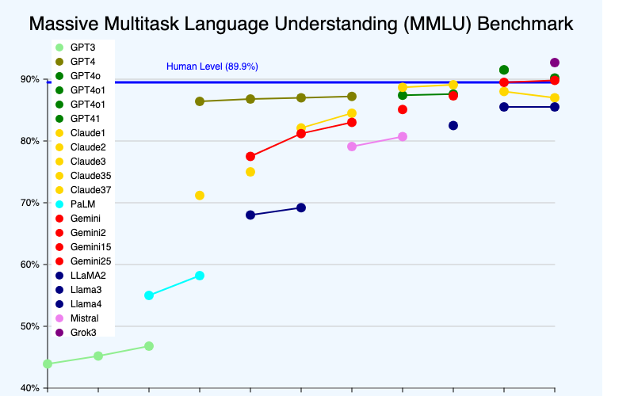
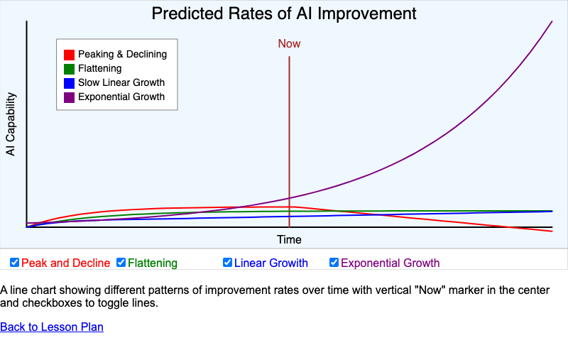
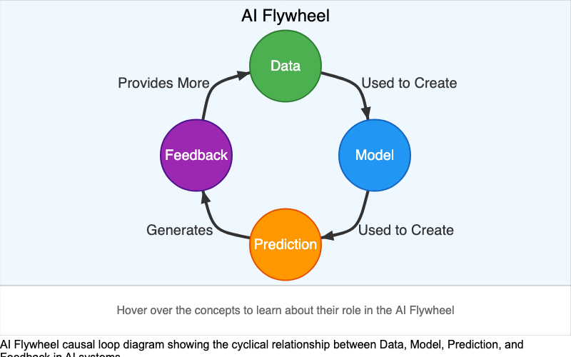
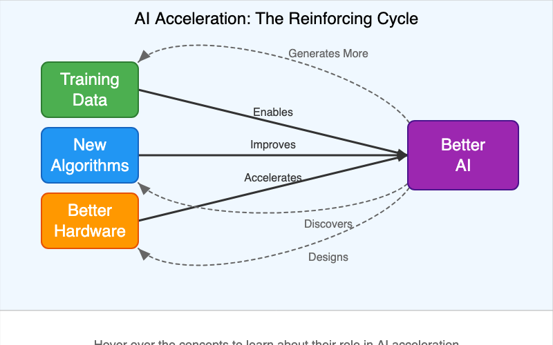
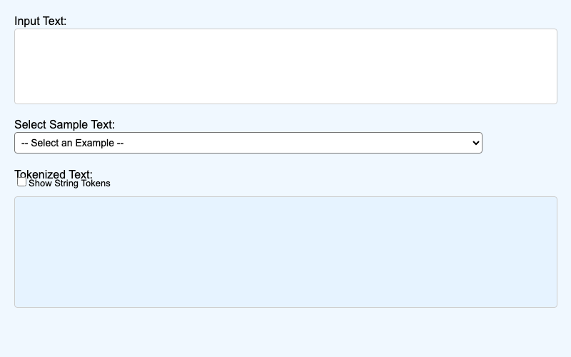
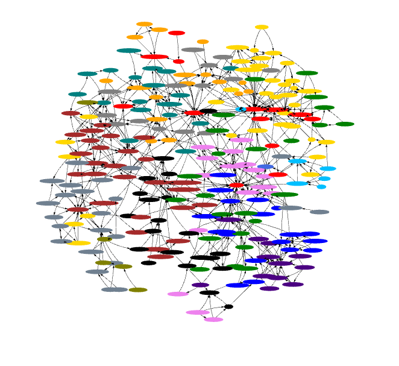
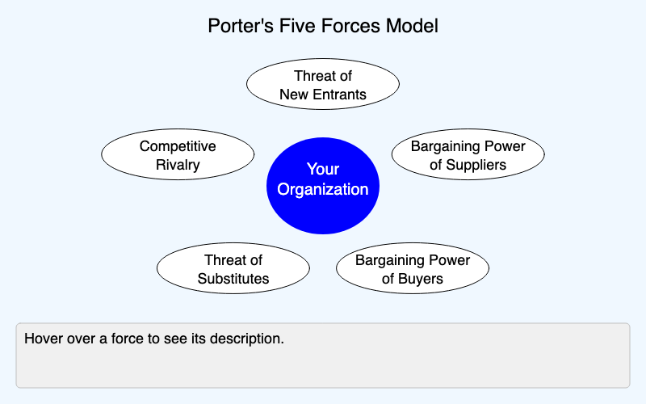
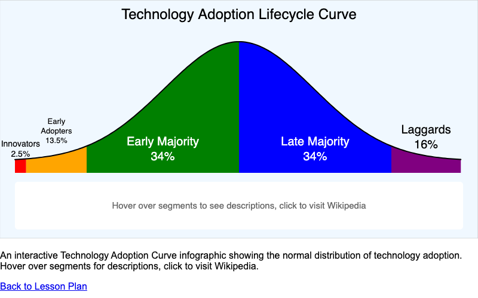
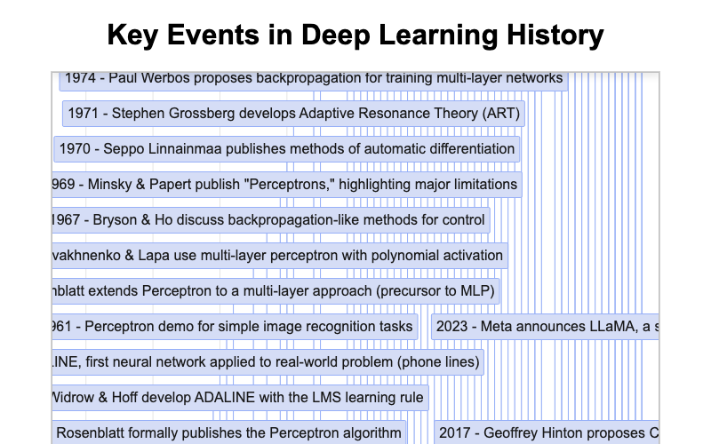

---
hide:
    toc
---
# MicroSimulations for Tracking AI Course

Interactive visualizations demonstrating AI capabilities, growth patterns, and strategic frameworks.

- **[AI Task Horizons](./ai-task-horizons/index.md)**

    
    Interactive visualization showing how long different AI models can work on tasks before failing.

- **[AI Benchmarks Timeline](./ai-benchmarks-timeline/index.md)**

    
    Timeline visualization of major AI benchmark milestones and capability progression.

- **[MMLU Timeline](./mmlu-timeline/index.md)**

    
    Interactive timeline showing AI model performance on the MMLU benchmark over time.

- **[LM Arena Timeline](./lm-arena-timeline/index.md)**

    
    Language Model Arena performance tracking based on human preferences.

- **[AI Doubling Rate](./ai-doubling-rate/index.md)**

    
    Analysis showing AI task completion length doubling approximately every seven months.

- **[Four Futures](./four-futures/index.md)**

    
    Explore four different scenarios for the rate of change of AI capabilities.

- **[AI Pace Accelerating](./ai-pace-accelerating/index.md)**

    
    Interactive visualization demonstrating the accelerating pace of AI development.

- **[Moore's Law](./moores-law/index.md)**

    
    Infographic showing Moore's Law progression in both linear and log scales.

- **[Power Wall](./power-wall/index.md)**

    
    Visualization of the CPU clock speed "power wall" phenomenon.

- **[AI Flywheel](./ai-flywheel/index.md)**

    
    Causal loop diagram illustrating how AI improvements create a self-reinforcing cycle.

- **[AI Causes of Acceleration](./ai-causes/index.md)**

    
    Causal loop diagram showing multiple factors driving AI acceleration.

- **[Autoregressive](./autoregressive/index.md)**

    
    Interactive demonstration of autoregressive text generation.

- **[Tokenizer](./tokenizer/index.md)**

    
    Interactive tool demonstrating how text is broken into tokens.

- **[Bloom's Taxonomy](./blooms-taxonomy/index.md)**

    
    Interactive infographic showing the six levels of Bloom's Taxonomy.

- **[Book Generation Workflow](./book-gen-workflow/index.md)**

    
    Workflow diagram showing the steps for generating intelligent textbooks.

- **[Book Levels](./book-levels/index.md)**

    
    Interactive visualization of the five levels of intelligent textbooks.

- **[Learning Graph](./learning-graph/index.md)**

    
    Interactive graph visualization for exploring course concept dependencies.

- **[Porter's Five Forces](./porters-five-forces/index.md)**

    
    Interactive diagram of Porter's Five Forces strategic analysis framework.

- **[AI SWOT Analysis](./swot/index.md)**

    
    Interactive SWOT analysis tool for evaluating AI adoption.

- **[Technology Adoption Curve](./technology-adoption/index.md)**

    
    Interactive infographic visualizing the Technology Adoption Lifecycle.

- **[Technology Hype Cycle](./hype-cycle/index.md)**

    
    Gartner's Technology Hype Cycle applied to AI development.

- **[AI Capability Maturity Model](./ai-cmm/index.md)**

    
    Five-level maturity model for organizational AI capabilities.

- **[GenAI Idea Funnel](./idea-funnel/index.md)**

    
    Interactive funnel showing the process of managing a GenAI Center of Excellence.

- **[AI Timeline](./timeline/index.md)**

    
    View key events in the history of AI and see how they are spaced.

