# MicroSimulations for Tracking AI Course

Interactive visualizations demonstrating AI capabilities, growth patterns, and strategic frameworks.

-   **[AI Benchmarks Timeline](./ai-benchmarks-timeline/index.md)**

    

    Interactive timeline showing key AI benchmarks and when they were introduced.

-   **[AI Capability Maturity Model](./ai-cmm/index.md)**

    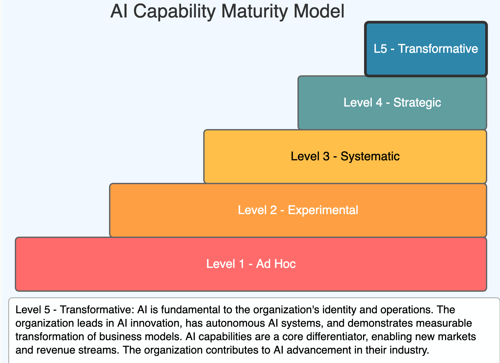

    Interactive visualization of five AI maturity levels from Ad Hoc to Transformative.

-   **[AI Causes of Acceleration](./ai-causes/index.md)**

    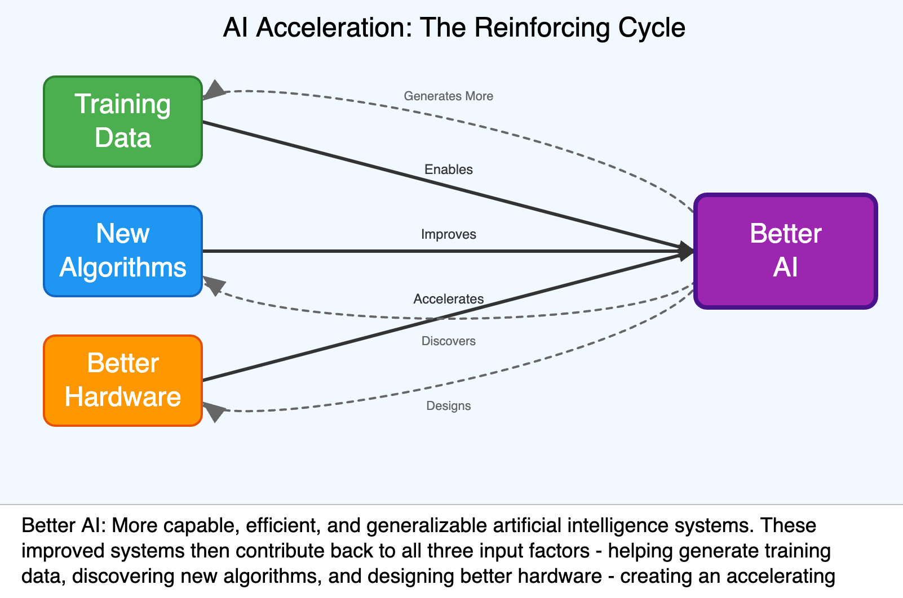

    A causal loop diagram showing how AI feedback is accelerating AI progress.

-   **[AI Doubling Rate](./ai-doubling-rate/index.md)**

    

    Analysis of AI task completion doubling rate based on METR research.

-   **[AI Flywheel](./ai-flywheel/index.md)**

    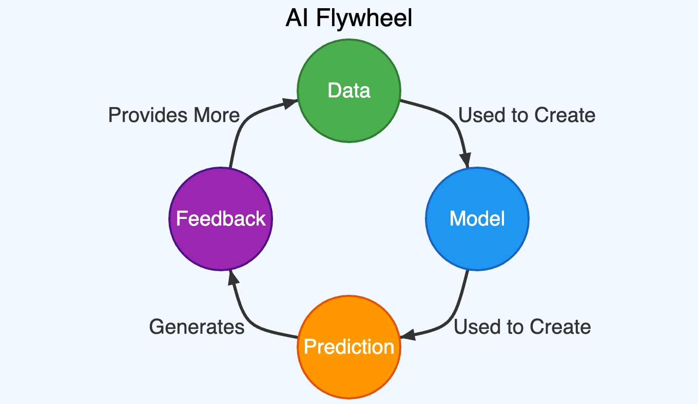

    An infographic MicroSim of the AI Flywheel causal loop.

-   **[AI Pace Accelerating](./ai-pace-accelerating/index.md)**

    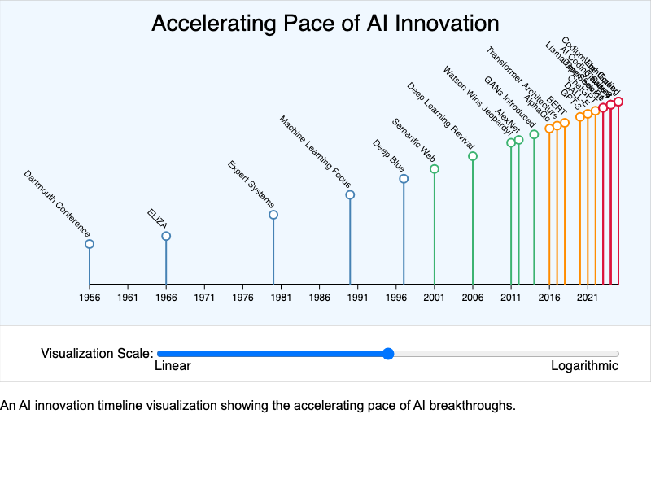

    Interactive visualization demonstrating how AI capabilities are accelerating.

-   **[AI SWOT Analysis](./swot/index.md)**

    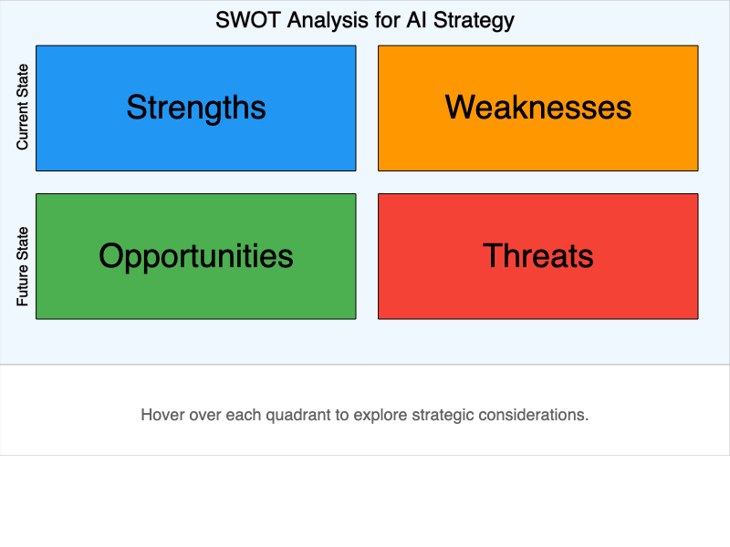

    Interactive SWOT analysis diagram for AI strategy development with hover descriptions.

-   **[AI Task Horizons](./ai-task-horizons/index.md)**

    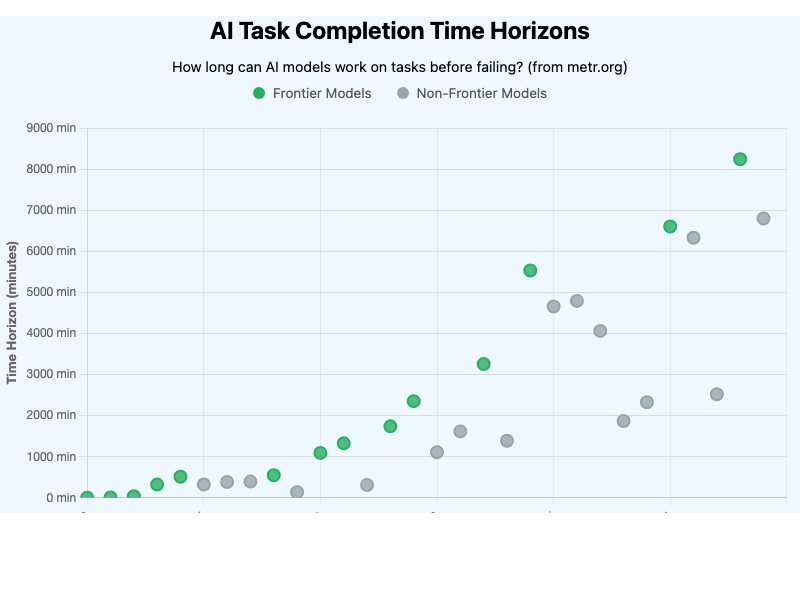

    Interactive visualization showing how long AI models can work on tasks based on METR research.

-   **[AI Timeline](./timeline/index.md)**

    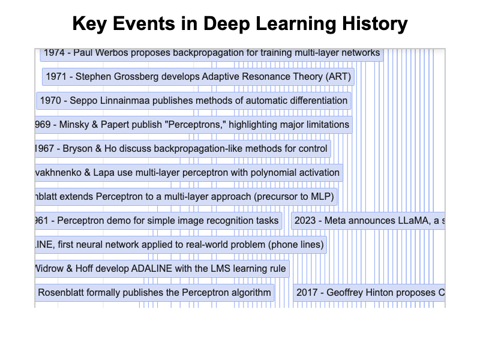

    Interactive timeline showing over 100 key events in Deep Learning history from 1935 to present.

-   **[Autoregressive](./autoregressive/index.md)**

    

    Interactive simulation showing how language models predict the next token using neural networks.

-   **[Bloom's Taxonomy](./blooms-taxonomy/index.md)**

    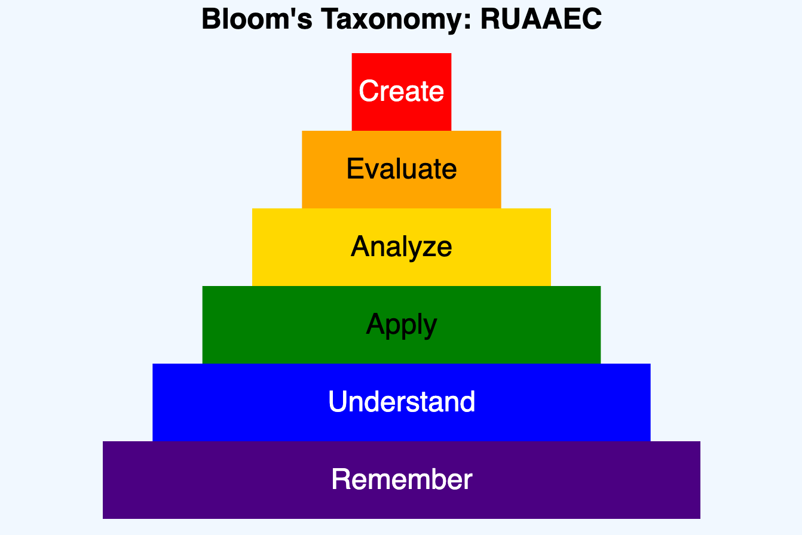

    Infographic with infobox hovers showing layers of Bloom's Taxonomy.

-   **[Book Generation Workflow](./book-gen-workflow/index.md)**

    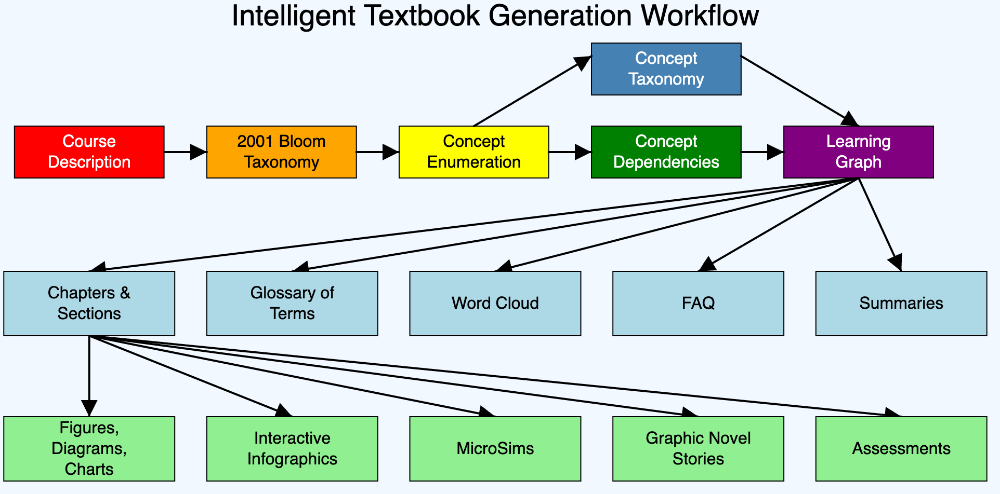

    Interactive infographic showing the workflow for generating intelligent textbooks.

-   **[Book Levels](./book-levels/index.md)**

    

    Interactive visualization of five levels of intelligent textbooks from static to AI-driven.

-   **[Four AI Futures](./four-futures/index.md)**

    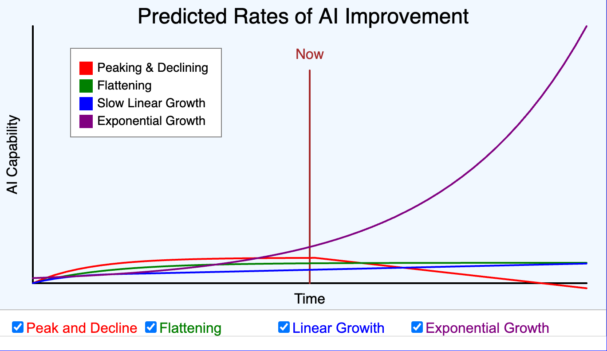

    Interactive chart showing four possible scenarios for AI development growth patterns.

-   **[GenAI Idea Funnel](./idea-funnel/index.md)**

    

    An interactive infographic showing the steps in managing a GenAI Center of Excellence.

-   **[Language Model Arena Timeline](./lm-arena-timeline/index.md)**

    

    Interactive visualization of LMArena benchmark rankings for AI models.

-   **[Learning Graph](./learning-graph/index.md)**

    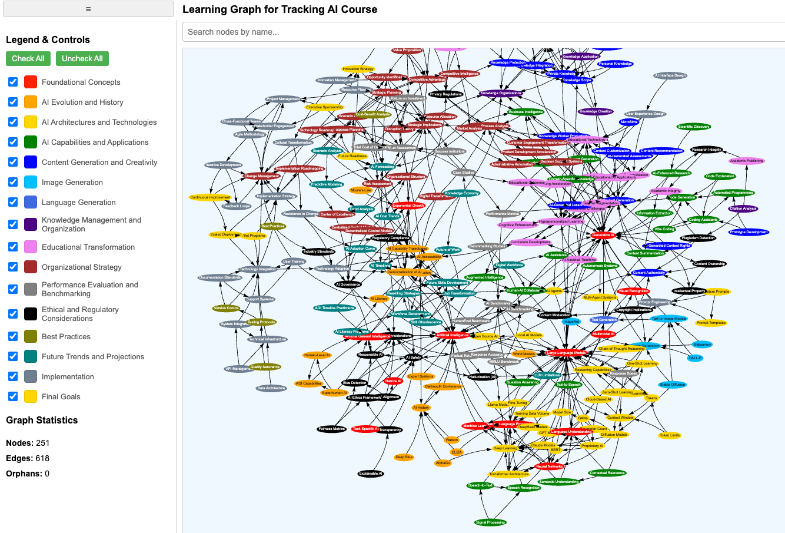

    Interactive visualization of concept dependencies in the Tracking AI curriculum.

-   **[MMLU Timeline](./mmlu-timeline/index.md)**

    

    Interactive visualization showing AI model progress on the MMLU benchmark.

-   **[Moore's Law](./moores-law/index.md)**

    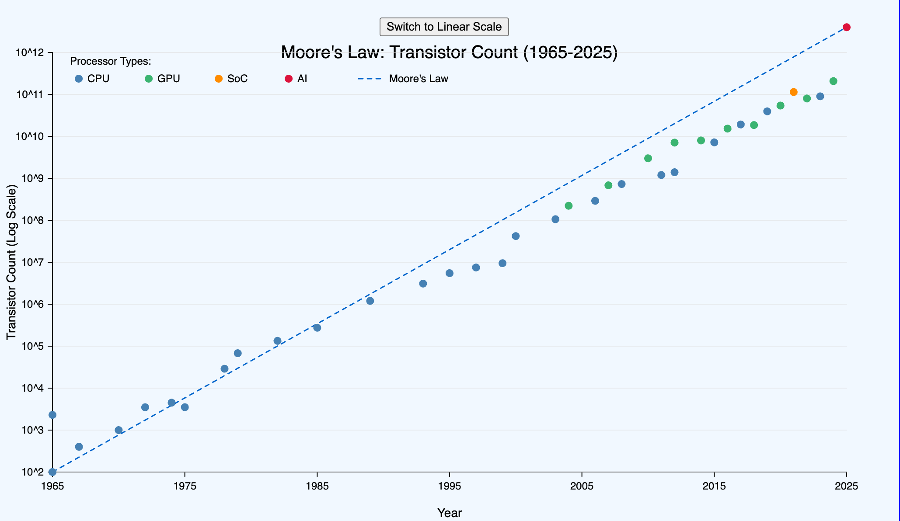

    Interactive infographic showing transistor growth with linear and log scale views.

-   **[Porter's Five Forces](./porters-five-forces/index.md)**

    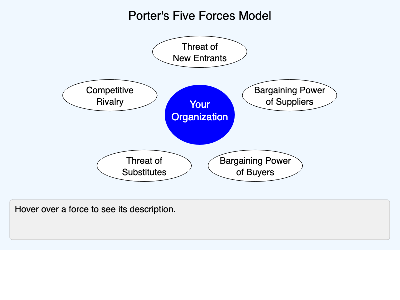

    Interactive visualization of Porter's Five Forces competitive analysis framework.

-   **[Power Wall](./power-wall/index.md)**

    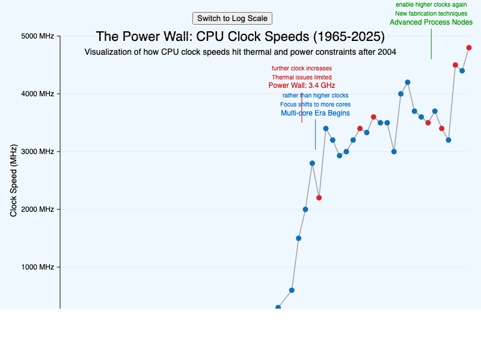

    Interactive visualization showing CPU clock speed evolution and the Power Wall phenomenon.

-   **[Projecting AI](./projecting-ai/index.md)**

    

    Interactive visualization showing exponential growth of AI task completion capabilities from 2019 to 2030.

-   **[Technology Adoption Curve](./technology-adoption/index.md)**

    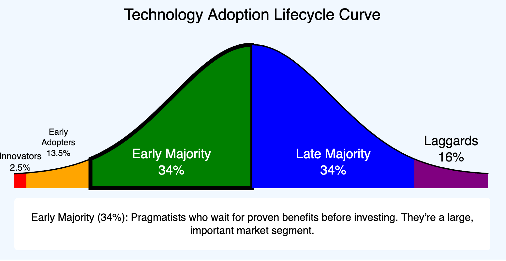

    An interactive infographic visualizing the Technology Adoption Lifecycle Curve.

-   **[Technology Hype Cycle](./hype-cycle/index.md)**

    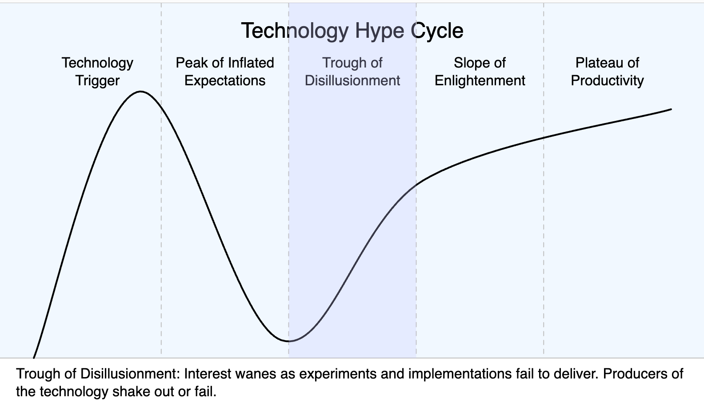

    Interactive visualization of the Gartner Technology Hype Cycle phases.

-   **[Tokenizer](./tokenizer/index.md)**

    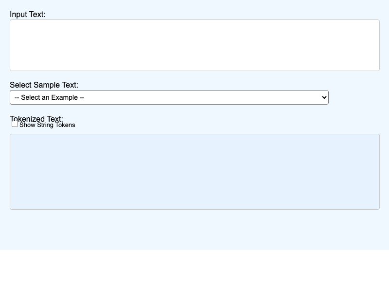

    Interactive visualization demonstrating how text is tokenized for language model processing.

