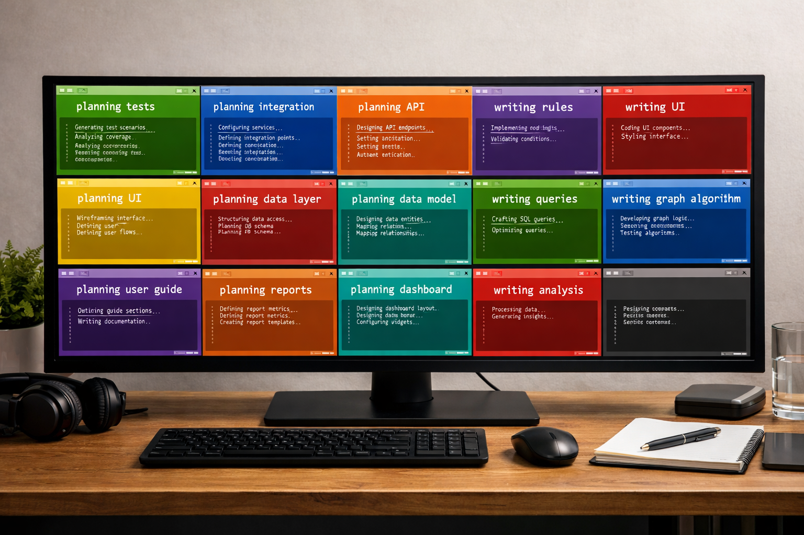
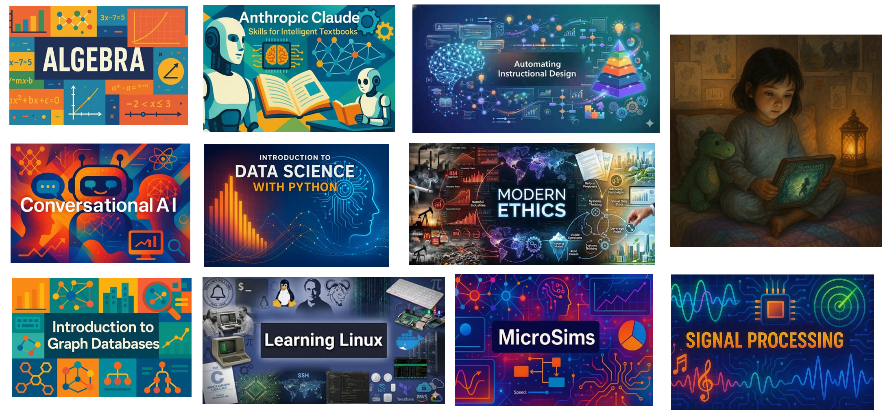

# Trends in AI

## Overview
This is a 40-minute presentation used to help college
seniors get a better understanding of the key trends
in artificial intelligence.  Give an overview of
the important concepts in measuring AI capabilities
and make some projections to understand if trends will
continues, where will this lead.

We then look at key skills and try to understand what
skills will be important in an AI dominated future.

## Four Futures

<iframe src="../../sims/four-futures/main.html" width="100%" height="520px" scrolling="no"></iframe>

## Moore's Law

<iframe src="../../sims/moores-law/main.html" width="100%" height="600px" scrolling="no"></iframe>

## Power Wall

<iframe src="../../sims/power-wall/main.html" width="100%" height="600px" scrolling="no"></iframe>

## AI Progress Is Difficult to Predict

> *Within a generation the problem of creating 'artificial intelligence' will substantially be solved.* 
> Marvin Minsky (1967)

[Overly Optimistic AI Claims](../../appendices/overly-optimistic-ai-claims)

## AI Systems Thinking

<iframe src="../../sims/ai-causes//main.html" width="100%" height="600px" scrolling="no"></iframe>

## AI Flywheel

<iframe src="../../sims/ai-flywheel/main.html" width="100%" height="470px" scrolling="no"></iframe>

## Traditional AI Benchmarks

<iframe src="../../sims/mmlu-timeline/main.html" height="550px" scrolling="no"
  style="overflow: hidden;"></iframe>

Many AI benchmarks show LLM capabilities approaching human-level skills like the [MMLU benchmark](../../sims/mmlu-timeline/index).

## Some AI Benchmark Compare LLMs with Each Other in an Arena

<iframe src="https://dmccreary.github.io/tracking-ai-course/sims/lm-arena-timeline/main.html"  height="450px" scrolling="no"></iframe>

[LM Arena Benchmark](../../sims/lm-arena-timeline/index)

## METR Task Horizons

<iframe src="../../sims/ai-doubling-rate/main.html" width="100%" height="700px" scrolling="no"></iframe>
The METR.org studies show that AI task completion has been doubling every 7 months since 2019.

## Projecting AI

<iframe src="../../sims/projecting-ai/main.html" width="100%" height="750px" scrolling="no"></iframe>
We can now project this trend line out until 2030.  The results are sometimes difficult to believe. In 2030 tasks that take 1,000 days will be possible with 50% chance of correctness.

## Modern Desktop

Boris Cherny said his desktop has 15 agents running concurrently.  10 are doing planning and 5 are writing code.

## Agent Skill Standards

- Agentic **Skills** are directory packing standards for agent rules
- Introduced by Anthropic in October 2025
- Now adopted by most LLM harnesses (OpenAI Codex, Cursor, Windsurf, Perplexity etc.)
- Allows consistent generation of code, content and images
- Gave me a 100x increase in the quality of MicroSimulations in interactive intelligent textbooks
- Clearly shows that AI progress is a non-linear function

[Claude Skills for Intelligent Textbooks](https://dmccreary.github.io/claude-skills/)

## Small Language Models (SLMs)

- SLMs achieve performance that rivals much larger models from just 1–2 years ago
- Extensive pruning and use of smaller weights (16, 8 and 4 bits) allow models to fit in smaller RAM
- Tools such as [Ollama](https://ollama.com/) continue to allow users to run AI models (both text-to-text and text-to-image) on local commodity GPU hardware (12GB to 24GB GPUs)
- Laptops and edge devices enable preserve privacy, allow for offline use, and promote low-latency AI applications

## RPA and OpenClaw

- **Natural language → desktop actions** – LLMs can translate user intent (“download this report and email it”) into step-by-step UI actions, enabling flexible RPA without rigid scripts using tools like OpenClaw.
- **Resilient to UI changes** – Vision + reasoning allows agents to adapt when buttons move or layouts change, reducing the brittleness of traditional RPA workflows.
- **End-to-end task automation** – LLM agents can orchestrate multi-app workflows (browser, spreadsheets, email clients) to complete complex business processes autonomously.
- **Rapid automation development** – Platforms like OpenClaw let developers prototype desktop control agents quickly, replacing weeks of rule-based scripting with prompt-driven automation.

## Graph-Based AI

- Structured Context & Grounding
- Explainability & Traceability
- Decision Intelligence
- GraphRAG
- Real-Time Connected Reasoning
- AI Agent Memory Layer

[View Graph](../../sims/learning-graph/view-graph.html)

## Case Study: Interactive Intelligent Textbooks

70 intelligent interactive textbook case studies

[Intelligent Textbook Case Studies](https://dmccreary.github.io/intelligent-textbooks/case-studies/)

## World Models are Coming

Instead of building a model of language and try to infer the world through language, build a world model directly.

[Yann Lecun and World Models](../../stories/yann-lecun/index)

## What Does This Mean for My Career?

If AI can design both hardware and software, what engineering positions will all be in demand?

Most of us will become "Product Managers"

## Product Managers

1. Must have strong **empathy** for your customers
2. Have and intuitive sense for what product and features their customers need
3. Will have the ability to orchestrate hundreds of concurrent agents

