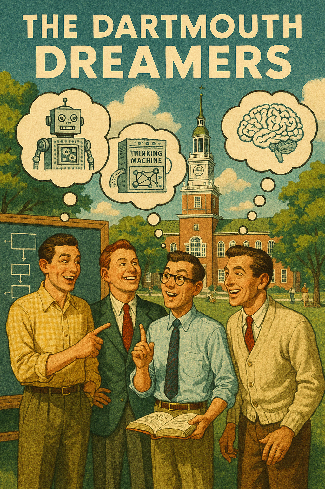
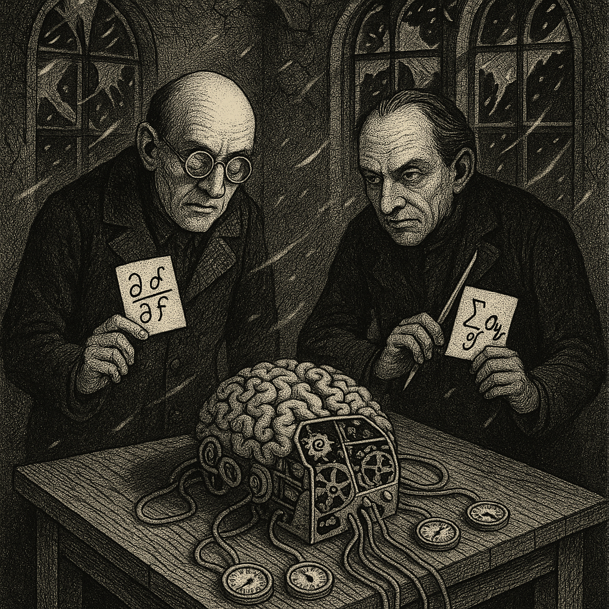
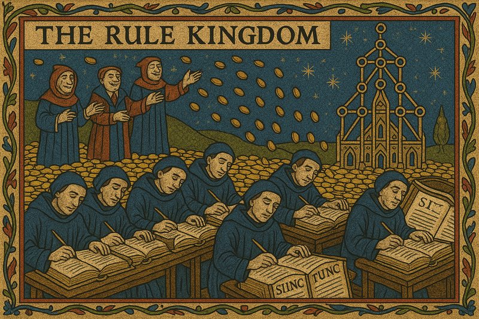
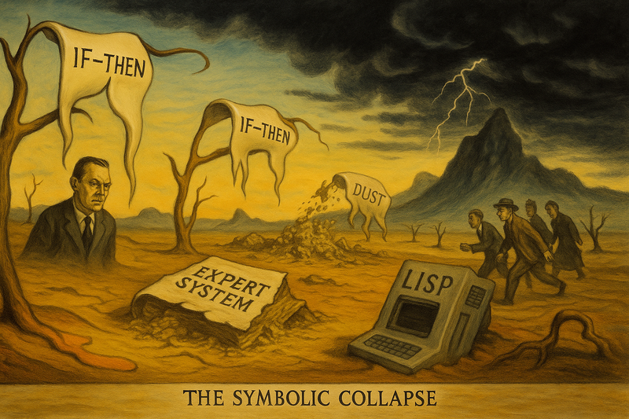
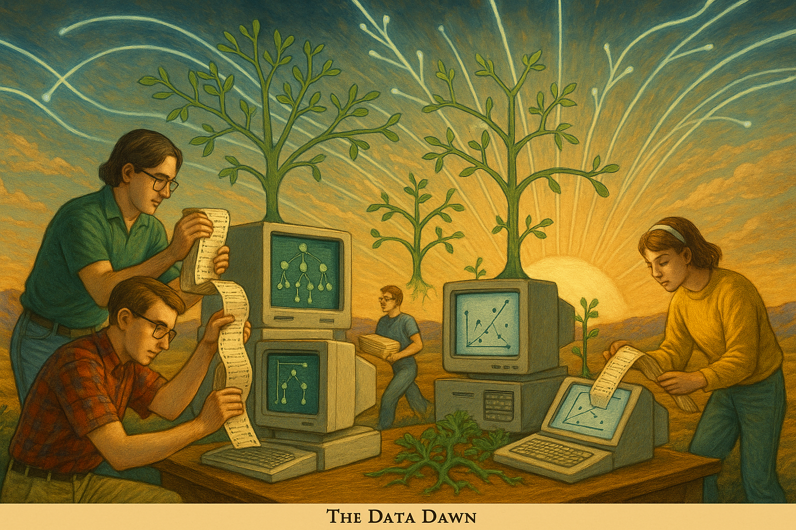
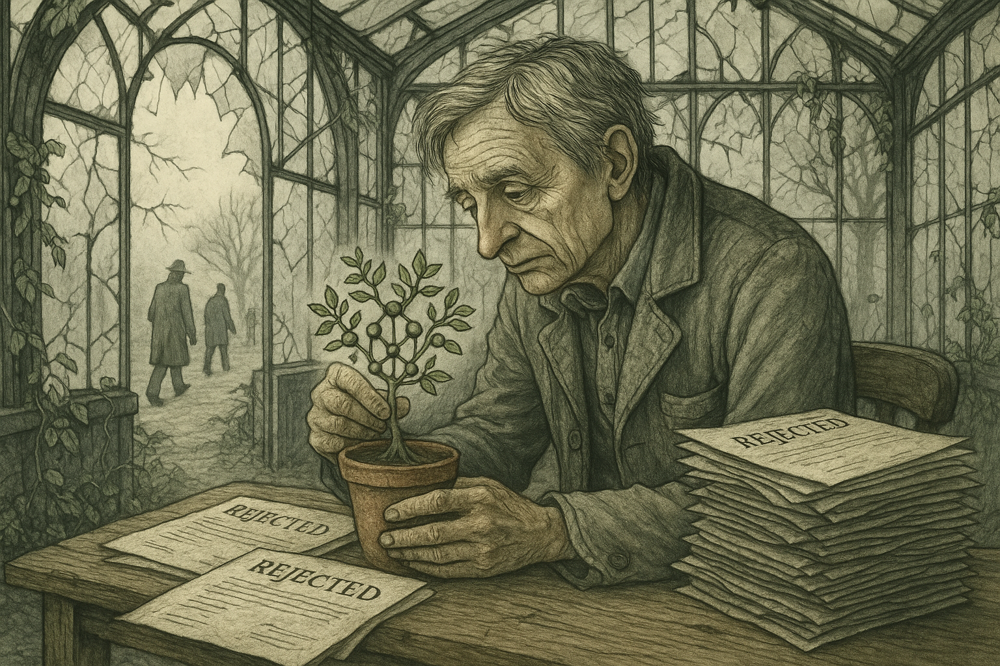
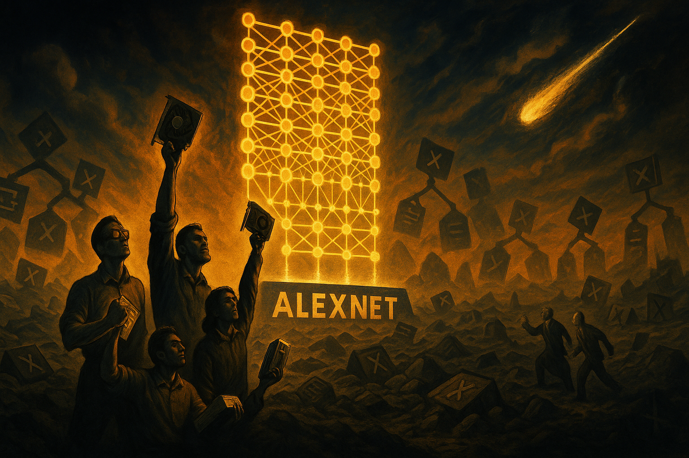

# The AI Winters: A Tale of Boom and Bust

Narrative Prompt

Create a fun and entertaining  story about the "AI winters" and how AI grew and died periodically until 2012 before AlexNet. Give as much detail as possible. Include quotes of famous people overpromising when AI would mature.  When appropriate, suggest an image that could be inserted into the story to make the story a form of graphic novel. Describe each image in detail and be consistent across all the images in the story for style.

Image Prompt

The Cycles of AI - A grand timeline visualization showing a wavy roller-coaster like path from the 1950s to 2012, with dramatic peaks and valleys marked by calendar pages fluttering away. In the foreground, various symbolic elements from each era (vacuum tubes, robots, neurons) are scattered like autumn leaves. Art style: detailed line art with watercolor washes, muted blues and grays for winter periods, warm oranges and yellows for boom periods.

## Chapter 1: The Birth of a Dream (1950s-1960s)

Image Prompt

 "The Dartmouth Dreamers" - A retro-style illustration showing a summer campus scene at Dartmouth College. In the foreground, four enthusiastic men in 1950s attire stand before a chalkboard covered in flowcharts and equations. Speech bubbles above their heads show thought clouds containing robots, thinking machines, and neural networks. Art style: Norman Rockwell meets mid-century scientific illustration.

It was the summer of 1956 when John McCarthy invited fellow dreamers to Dartmouth College for what would become known as the birth of artificial intelligence. McCarthy boldly declared:

> "We propose that a 2-month, 10-man study of artificial intelligence be carried out during the summer of 1956... An attempt will be made to find how to make machines use language, form abstractions and concepts, solve kinds of problems now reserved for humans, and improve themselves."

Herbert Simon and Allen Newell were even bolder, proclaiming at the conference: "Within ten years, a digital computer will be the world's chess champion" and "within twenty years, machines will be capable of doing any work a man can do."

The optimism was intoxicating. Money poured in from government and industry. Marvin Minsky predicted in 1970: "In from three to eight years we will have a machine with the general intelligence of an average human being."

## Chapter 2: The First AI Winter (1973-1980)

Image Prompt

 "The Perceptron's Demise" - A gothic-horror inspired scene showing a mechanical brain or perceptron being dissected on a table, with Minsky and Papert looming over it holding mathematical equations like scalpels. Snow blows through broken windows of a once-grand laboratory. Art style: Edward Gorey-esque crosshatching with dramatic shadows.

The first winter came suddenly. In 1969, Marvin Minsky and Seymour Papert published "Perceptrons," mathematically proving that simple neural networks couldn't even solve basic problems like XOR. The book was like a bucket of ice water on the field's optimism.

Government funding dried up after the 1973 Lighthill Report called AI research a dead end. Labs shuttered. Graduate students fled to other fields. The promised thinking machines had failed to materialize, and the world lost patience.

## Chapter 3: The Expert Systems Spring (1980-1987)

Image Prompt

 "The Rule Kingdom" - An illustration in the style of a medieval manuscript showing programmers as monks transcribing thousands of IF-THEN rules into giant books. In the background, executives throw gold coins at them. A mechanical decision tree towers like a cathedral spire. Art style: illuminated manuscript meets corporate tech, rich golds and blues.

Like crocuses pushing through snow, AI began to bloom again with expert systems. These rule-based programs promised to capture human expertise in code. Edward Feigenbaum declared:

> "The world is moving from the industrial age to the age of knowledge... knowledge is power."

DEC's XCON system saved the company $40 million a year configuring computers. Japan announced their Fifth Generation Computer project in 1982, promising to create intelligent computers by 1992. The AI race was back on.

## Chapter 4: The Second AI Winter (1987-1993)

Image Prompt

 "The Symbolic Collapse" - A surreal Dali-esque landscape where giant IF-THEN rules melt like clocks, expert system books crumble to dust, and abandoned LISP machines rust in a wasteland. Government officials and investors flee under dark storm clouds. Art style: Salvador Dali meets corporate dystopia.

But expert systems hit a wall. They were brittle, expensive to maintain, and couldn't handle the messy real world. By 1987, the AI hardware market collapsed. The Japanese Fifth Generation project failed to deliver on its promises.

Rodney Brooks wrote a scathing critique in 1990: "The symbol system hypothesis upon which classical AI is based is fundamentally flawed." Companies that had bet heavily on AI went bankrupt. Another winter had begun.

## Chapter 5: The Machine Learning Spring (1993-2001)

Image Prompt

 "The Data Dawn" - A scene showing nerdy programmers in 90s attire feeding stacks of data into computers while decision trees and support vector machines grow like plants from the machines. In the background, the early internet is represented as glowing fiber optic cables spreading like vines. Art style: cyber-renaissance, mixing classical composition with 90s tech aesthetics.

AI quietly reinvented itself. Machine learning algorithms that could learn from data began to show promise. IBM's Deep Blue defeated world chess champion Garry Kasparov in 1997. Search engines started using statistical methods to rank web pages.

Vladimir Vapnik developed support vector machines. Yann LeCun built convolutional neural networks for handwriting recognition. But these successes were modest compared to earlier promises.

## Chapter 6: The Deep Learning Revolution (2006-2012)

Image Prompt

 "The Persistent Professor" - Geoffrey Hinton is shown as a lone figure nurturing a small neural network plant in a cold, abandoned greenhouse. Through broken glass, we can see other researchers walking away. On his desk are piles of rejected grant applications. Art style: melancholic botanical illustration with a hint of steampunk.

While most had abandoned neural networks, Geoffrey Hinton kept the faith. In 2006, he discovered a way to train deep neural networks using a technique called "pre-training." But few paid attention.

Hinton later recalled: "For many years, deep neural networks were considered a joke in the machine learning community."

## Chapter 7: The AlexNet Breakthrough (2012)

Image Prompt

 "The ImageNet Triumph" - A heroic scene showing AlexNet as a glowing neural network architecture towering over a field of failed algorithms. At its base, the Toronto team raises their GPUs like olympic torches. In the sky, the error rate plummets like a shooting star. Art style: heroic socialist realism meets cyberpunk, dramatic angles and lighting.

And then came 2012. AlexNet's victory at ImageNet shattered decades of conventional wisdom. The 10.8% improvement wasn't just impressive—it was revolutionary.

Geoffrey Hinton reflected: "It was pretty clear that as soon as we got deep learning to work well on ImageNet, the game was over. The people who thought neural nets were never going to work were always going to find reasons why the next thing wouldn't work."

## Epilogue: The Eternal Spring

Image Prompt

 "The Endless Spring" - A final panoramic view showing all the AI winters and springs as a continuous landscape, but now with a great branching tree of achievement rising from AlexNet, its branches reaching into a starry sky filled with AI applications. The art style combines all previous styles into a cohesive grand finale.

After AlexNet, there would be no more winters. The combination of big data, GPU acceleration, and improved algorithms had finally unlocked the promise of AI. The boom-and-bust cycle that had characterized the field for half a century was over.

The AI winters teach us that technology rarely advances in a straight line. Progress comes in fits and starts, with periods of irrational exuberance followed by crushing disappointment. But sometimes, persistence in the face of skepticism leads to breakthroughs that change everything.

As we look to the future of AI, it's worth remembering this history—not just to avoid repeating mistakes, but to appreciate how today's achievements were built on decades of perseverance through the coldest winters.