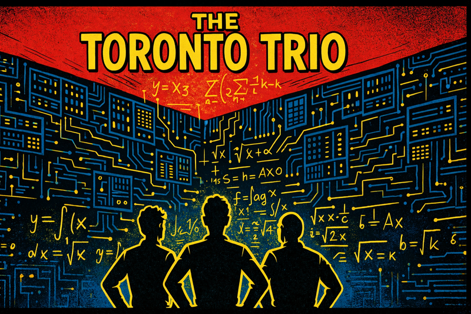
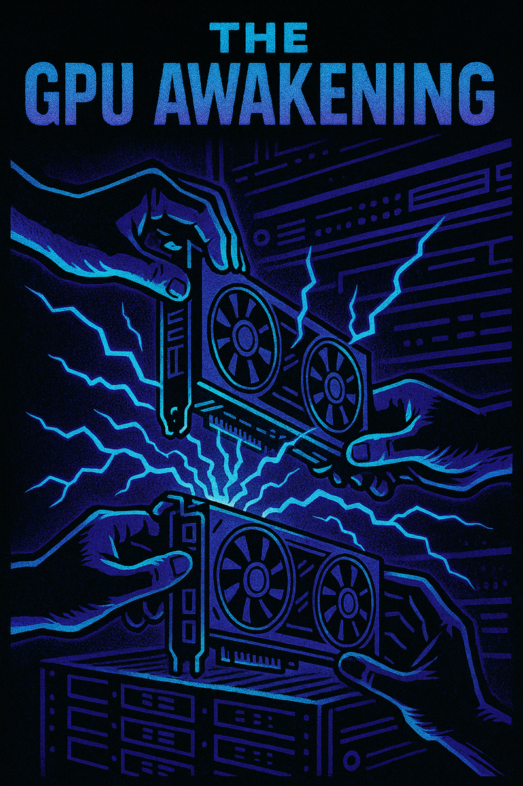
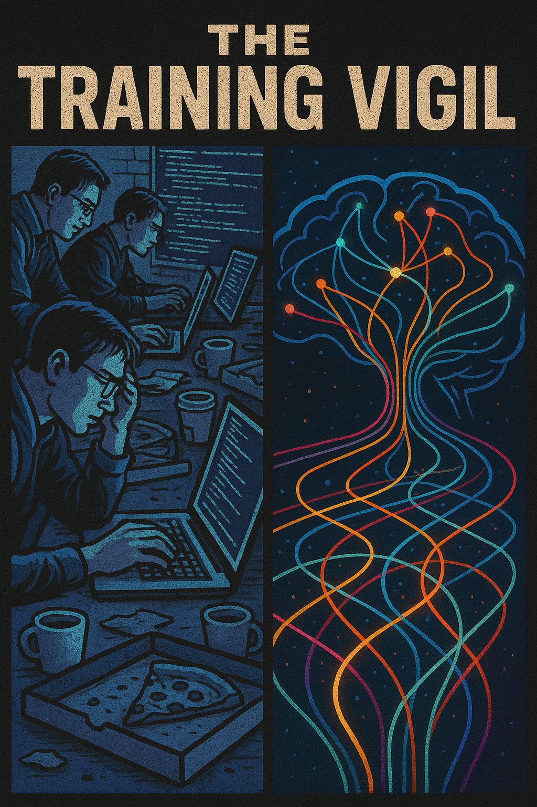
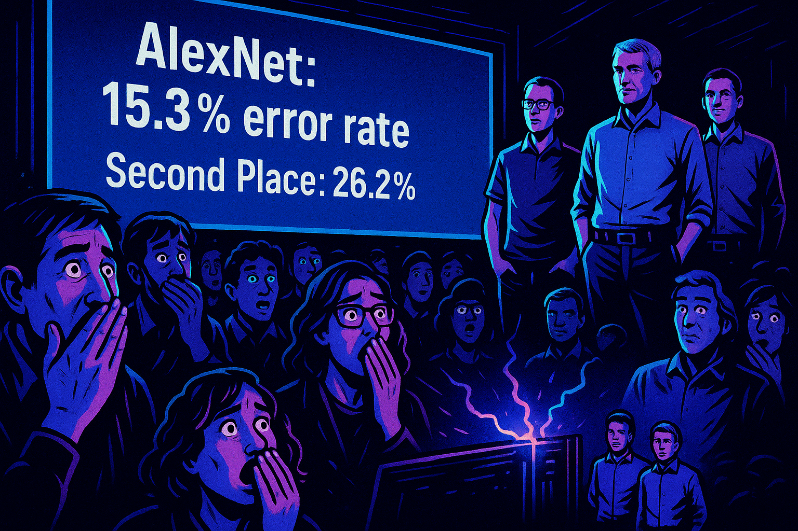
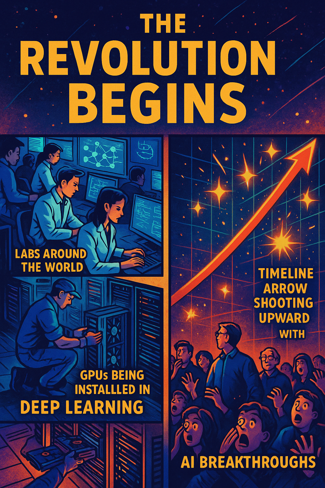
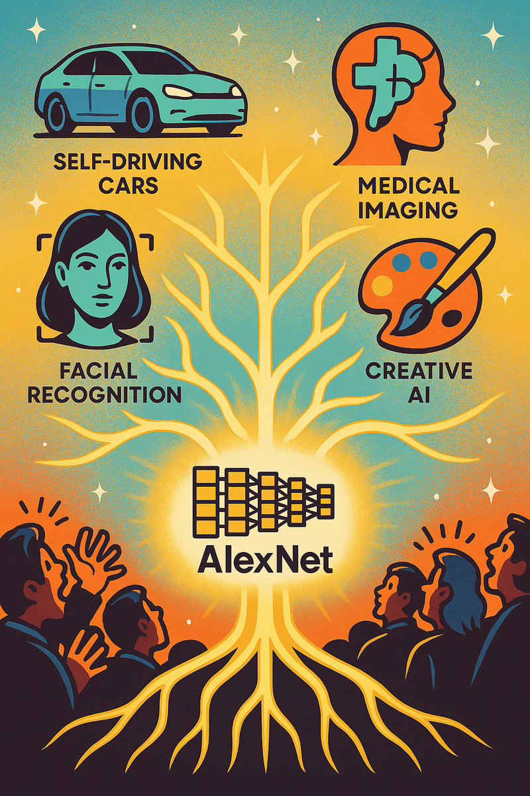

# The Day AlexNet Changed Everything: The ImageNet Conquest of 2012

Image Prompt

Create a cover image for this story.

In the world of artificial intelligence, there are watershed moments that fundamentally change the course of history. The ImageNet 2012 competition was one such moment, where an unlikely group of researchers staged what would become known as the "deep learning revolution."

## The Underdog Challengers

Image Prompt

 1: "The Toronto Trio" - A stylized graphic novel panel showing three figures in silhouette standing before a massive wall of circuit boards and mathematical equations. Hands on hips, they look up at the challenge ahead. The art style should be high-contrast black and white with bold digital line work, reminiscent of a superhero origin story.  The students are Alex Krizhevsky, Ilya Sutskever, and their advisor Geoffrey Hinton.

In 2012, the ImageNet Large Scale Visual Recognition Challenge (ILSVRC) was already in its third year. The competition asked teams to classify millions of images into 1,000 different categories—everything from goldfish to golf balls, from strawberries to space shuttles. Previous winners had achieved error rates of around 26%, using methods that had dominated computer vision for decades.

Enter three researchers from the University of Toronto: Alex Krizhevsky, Ilya Sutskever, and their advisor Geoffrey Hinton. They had an audacious plan: to use neural networks, a technology most researchers had written off as computationally infeasible, to tackle the world's largest image recognition challenge.

## The Secret Weapon: GPU Acceleration

Image Prompt

 2: "The GPU Awakening" - A dynamic comic panel showing hands connecting gaming graphics cards into a server rack, with electric energy bolts emanating from the connections. The scene is rendered in neon blues and purples against a dark background, cyberpunk-style.

Krizhevsky had a brilliant insight: while CPUs were too slow to train large neural networks, the massively parallel architecture of gaming GPUs could potentially speed up the process by orders of magnitude. The team secured two NVIDIA GTX 580 GPUs, each with just 3GB of memory—a pittance by today's standards.

Their architecture, which would later be named AlexNet after Krizhevsky, was unlike anything the computer vision community had seen:
- 60 million parameters
- 5 convolutional layers
- 3 fully connected layers
- Novel use of ReLU activation functions
- Local response normalization
- Overlapping pooling
- Dropout for regularization

## Training Day

Image Prompt

 3: "The Training Vigil" - A split-panel showing: Left side, researchers hunched over computers with coffee cups and pizza boxes scattered around, code scrolling on screens. Right side, a visualization of neural networks learning patterns, represented as streams of colored light flowing through an abstract brain structure. The art style mixes realistic elements with digital abstraction.

The team spent weeks training their network on 1.2 million images. The training process was grueling—they had to split the network across two GPUs just to fit it in memory. Each epoch took hours, and they needed to run hundreds of epochs to achieve convergence. The lab became their second home, with team members taking shifts to monitor the training process day and night.

## Competition Day

Image Prompt

 4: "The Revealing" - A dramatic panel showing the moment the results are displayed on a giant screen. In the foreground, the crowd gasps in shock, while the Toronto team stands quietly confident. The screen shows: "AlexNet: 15.3% error rate" with second place at "26.2%". The scene is rendered in a cinematic style with dramatic lighting.

When the results were announced, the computer vision community was stunned. AlexNet achieved a top-5 error rate of 15.3%, an astounding 10.8% improvement over the second-place finisher. It wasn't just an incremental improvement—it was a quantum leap that shattered conventional wisdom.

## The Aftermath

Image Prompt

 5: "The Revolution Begins" - A montage panel showing the aftermath: labs around the world switching to deep learning, GPUs being installed in research centers, and a timeline arrow shooting upward with AI breakthroughs popping up like sparks. The art style transitions from the grounded reality of the previous panels to a more abstract, inspiring vision of the future.

The victory of AlexNet marked the beginning of the deep learning revolution. Almost overnight, computer vision researchers around the world began adopting neural networks. The demand for GPUs skyrocketed, NVIDIA's stock price soared, and deep learning became the dominant paradigm in AI research.

Geoffrey Hinton would later call it "the moment when deep learning went from being a niche pursuit to being mainstream." Alex Krizhevsky went on to work at Google, then launched his own company. Ilya Sutskever would become one of the co-founders of OpenAI.

## Legacy

Image Prompt

 6: "The Neural Future" - An epilogue panel showing modern AI applications branching out from AlexNet like a technological tree of life: self-driving cars, medical imaging, facial recognition, and creative AI. At the center is the original AlexNet architecture diagram, glowing like a seed. The art style is optimistic and bright, with a touch of retro-futurism.

Today, AlexNet seems almost quaint compared to massive transformers and diffusion models. But its impact cannot be overstated. It proved that with enough data and computational power, neural networks could achieve what decades of hand-crafted algorithms could not. It sparked a paradigm shift that led to today's AI revolution.

The story of AlexNet is a reminder that sometimes, the most revolutionary breakthroughs come not from incremental improvements, but from those willing to challenge conventional wisdom and pursue ideas that others have dismissed as impossible.

*This graphic novel-style account celebrates the historic moment when AlexNet changed the trajectory of artificial intelligence forever, proving that sometimes the greatest revolutions start with a few researchers, some gaming hardware, and an unwavering belief in an idea whose time has come.*

## References

-   [ImageNet Classification with Deep Convolutional Neural Networks](https://papers.nips.cc/paper_files/paper/2012/hash/c399862d3b9d6b76c8436e924a68c45b-Abstract.html) - 2012, Advances in Neural Information Processing Systems (NIPS)
-   [The History of AlexNet](https://medium.com/@allenschool/the-history-of-alexnet-and-how-it-changed-deep-learning-f1ad0c841950) - 2020, Medium
-   [AlexNet: The Architecture That Challenged CNNs](https://towardsdatascience.com/alexnet-the-architecture-that-changed-cnns-e8c1653e28f6) - 2020, Towards Data Science
-   [Machine Learning Yearning](https://www.deeplearning.ai/machine-learning-yearning/) - 2018, deeplearning.ai, by Andrew Ng
-   [Deep Learning Revolution: How a Toronto team's 'AlexNet' changed AI forever](https://www.cbc.ca/news/science/deep-learning-ai-hinton-lecun-bengio-1.5094076) - 2019, CBC News
-   [New AI Milestone: Deep Learning Conquers ImageNet](https://www.forbes.com/sites/johnvillasenor/2014/01/31/new-ai-milestone-deep-learning-conquers-imagenet/) - 2014, Forbes
-   [The Deep Learning Revolution](https://mitpress.mit.edu/books/deep-learning-revolution) - 2018, MIT Press, by Terrence J. Sejnowski
-   [Geoffrey Hinton: On Radiology](https://www.youtube.com/watch?v=2HMPRXstSvQ) - 2016, YouTube
-   [Ilya Sutskever: The Future of AI Research](https://openai.com/blog/organizational-update/) - 2018, OpenAI Blog
-   [The Rise of GPU Computing](https://www.nvidia.com/en-us/about-nvidia/ai-computing/) - 2022, NVIDIA Official Website