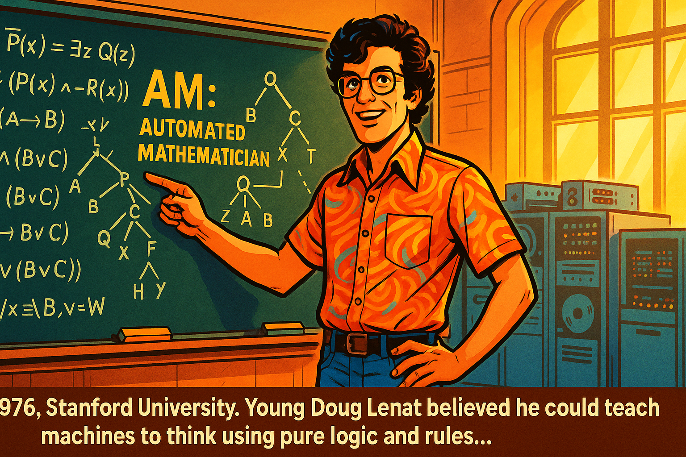
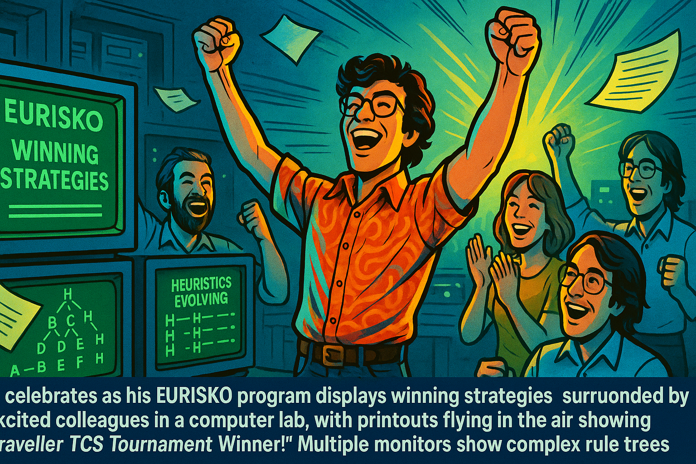
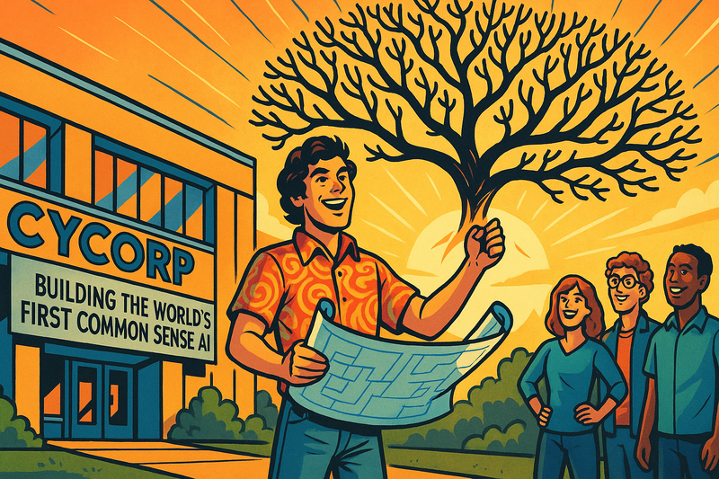
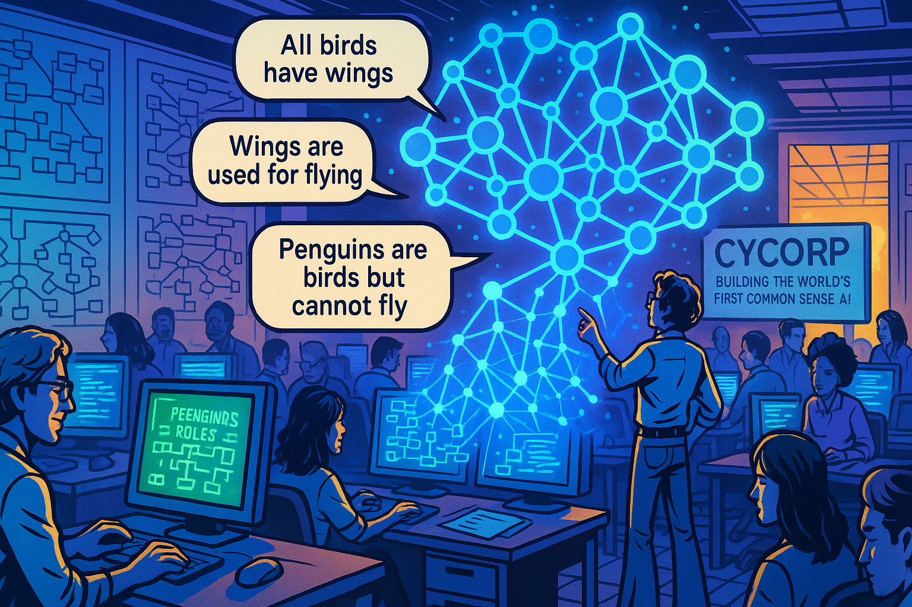
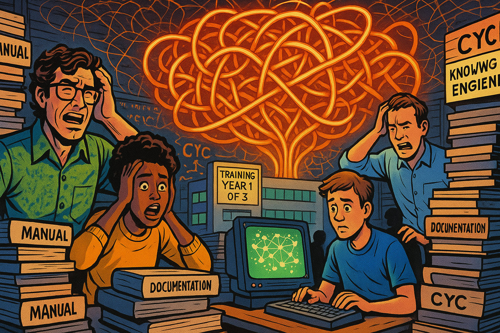
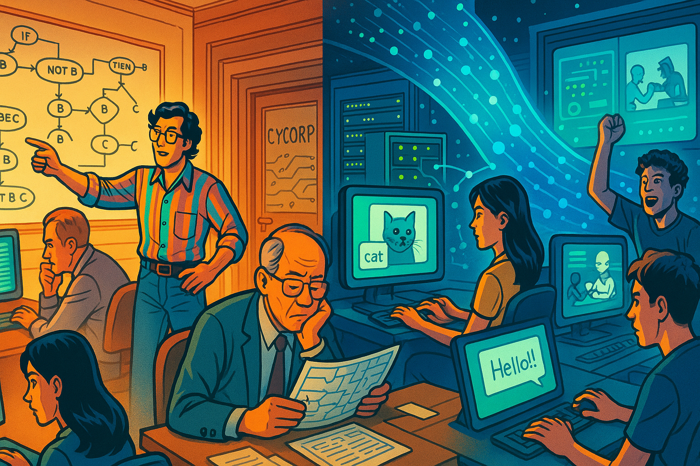
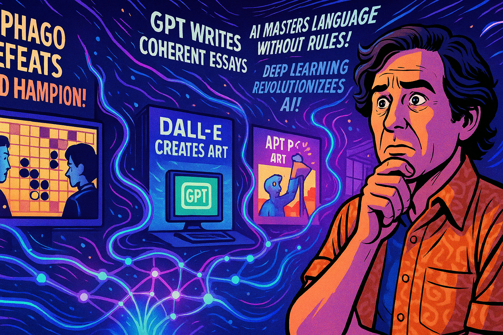
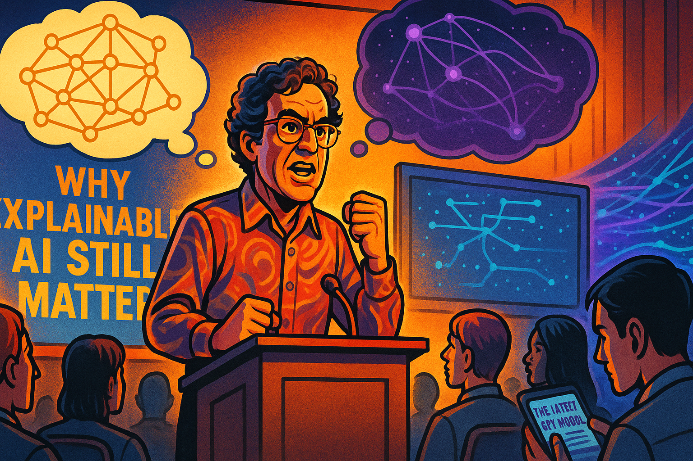
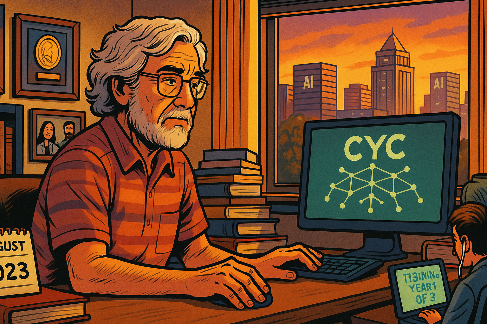
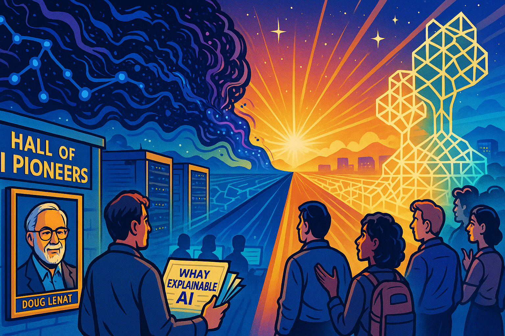

# Doug Lenat and Cyc

## Panel 1: The Young Visionary (1970s)

Young Doug's Ambition

Generate a wide-landscape graphic novel drawing with a width:height ratio of 16:9. Use bright colors as in a positive high-energy tech-forward comic book. Show a young Doug Lenat in his 20s at Stanford University, standing confidently in front of a blackboard filled with complex logical formulas and tree diagrams. He's wearing 1970s attire - bell-bottom jeans and a colorful shirt. Behind him, early mainframe computers with blinking lights and tape reels. His eyes sparkle with determination as he points to a diagram labeled "AM: Automated Mathematician." The room glows with warm golden light streaming through tall university windows, symbolizing the dawn of his ambitious vision.

In 1976 at Stanford University a young Doug Lenat believed he could teach machines to think using pure logic and IF/THEN rules.

## Panel 2: The Breakthrough (Late 1970s)

EURISKO's Success

Panel 2:
Generate a wide-landscape graphic novel drawing with a width:height ratio of 16:9. Use bright colors as in a positive high-energy tech-forward comic book. 
Make the drawing consistent with prior images.

Show Doug celebrating as his EURISKO program displays winning strategies on a green phosphor monitor. The scene shows him surrounded by excited colleagues in a computer lab, with printouts flying in the air showing "Traveller TCS Tournament Winner!" Multiple monitors show complex rule trees and heuristics evolving. The atmosphere is electric with success, rendered in vibrant blues and greens with dramatic lighting suggesting a major breakthrough moment.

His program EURISKO won the Traveller TCS naval fleet design tournament twice, proving that symbolic AI could outsmart humans on some tasks.

## Panel 3: The Grand Vision (1984)

Founding Cycorp

Panel 3:
Generate a wide-landscape graphic novel drawing with a width:height ratio of 16:9. Use bright colors as in a positive high-energy tech-forward comic book. 
Make the drawing consistent with prior images.
Do not put captions in the bottom of the image.

Show Doug Lenat standing in front of the newly established Cycorp building in Austin, Texas. He's holding architectural blueprints that transform into a massive tree of knowledge floating above him in the sky - branches representing different domains of human knowledge. The sun rises behind the building casting everything in hopeful orange and yellow hues. A sign reads "Cycorp: Building the World's First Common Sense AI." Several enthusiastic young engineers stand beside him, ready to embark on this monumental journey.

"1984: With millions in funding, Lenat founded Cycorp. The mission: encode all human common sense into one massive knowledge base called Cyc."

---

## Panel 4: The Knowledge Engineers (1980s-1990s)

Building Cyc

Panel 4:
Generate a wide-landscape graphic novel drawing with a width:height ratio of 16:9. Use bright colors as in a positive high-energy tech-forward comic book.
Make the drawing consistent with prior images. 
Do not put captions in the bottom of the image.

Show a large open office filled with dozens of knowledge engineers at computer terminals, each entering logical rules and facts. The walls are covered with massive flowcharts and ontology diagrams. In the center, a holographic visualization shows Cyc's knowledge graph growing like a luminous neural network, but made of interconnected logical statements. Text bubbles show examples: "All birds have wings," "Wings are used for flying," "Penguins are birds but cannot fly." The scene uses cool blues and purples with bright accent colors for the knowledge visualization.

For years, armies of knowledge engineers painstakingly encoded millions of facts and rules, teaching Cyc that 'water is wet' and 'people die when killed'..."

## Panel 5: The Complexity Monster (Late 1990s)

System Overwhelming

Panel 5
Generate a wide-landscape graphic novel drawing with a width:height ratio of 16:9. Use bright colors as in a positive high-energy tech-forward comic book. 
Make the drawing consistent with prior images. 
Do not put captions in the bottom of the image.

Show Doug Lenat and his team looking overwhelmed, surrounded by towering stacks of manuals and documentation. A massive tangled web of logical connections fills the background like a maze. A new hire sits at a desk with a sign "Training Year 1 of 3" looking bewildered. The Cyc system is visualized as a massive Gordian knot of interconnected rules glowing in reds and oranges, suggesting complexity and heat. Engineers hold their heads in frustration as they try to debug logical contradictions.

But Cyc grew into a monster. New engineers needed years of training. Simple updates required understanding millions of interconnections..."

## Panel 6: The Neural Network Revolution (2010s)

Deep Learning Rises

Panel 6:
Generate a wide-landscape graphic novel drawing with a width:height ratio of 16:9. Use bright colors as in a positive high-energy tech-forward comic book. 
Make the drawing consistent with prior images. 
Do not put captions in the bottom of the image.

Show a split scene: On the left, the Cycorp office with Doug and his team working on complex logical rules, looking traditional and methodical. On the right, a modern tech company with young engineers training neural networks on GPUs, screens showing image recognition, natural language processing, and game-playing AIs defeating humans. A wave of data points and neural network visualizations in electric blues and greens crashes over from the right side, threatening to overwhelm the left. The contrast is stark between old and new approaches.

Meanwhile, a revolution was brewing. Deep learning needed no hand-coded rules - just data and computational power..."

## Panel 7: The Shocking Overtake (Mid-2010s)

AI Breakthrough Moments

Panel 7:
Generate a wide-landscape graphic novel drawing with a width:height ratio of 16:9. Use bright colors as in a positive high-energy tech-forward comic book. 
Make the drawing consistent with prior images. 
Do not put captions in the bottom of the image.

Show multiple screens displaying breakthrough moments: AlphaGo defeating the world champion, GPT writing coherent essays, DALL-E creating art. In the foreground, Doug Lenat watches these developments with a mix of surprise and concern. The neural networks are visualized as flowing, organic streams of light in vibrant purples and cyans, easily accomplishing tasks that Cyc struggled with for decades. Headlines float in the air: "AI Masters Language Without Rules!" "Deep Learning Revolutionizes AI!"

In just a few years, neural networks surpassed decades of Cyc's careful knowledge engineering, understanding language and concepts without a single hand-coded rule..."

## Panel 8: The Stubborn Defender (2020s)

Lenat's Last Stand

Panel 8:
Generate a wide-landscape graphic novel drawing with a width:height ratio of 16:9. Use bright colors as in a positive high-energy tech-forward comic book. 
Make the drawing consistent with prior images. 
Do not put captions in the bottom of the image.

Show an older Doug Lenat standing firm at a podium, passionately defending symbolic AI at a conference. Behind him, a presentation shows "Why Explainable AI Still Matters." The audience is split - some nodding in agreement, others on their phones reading about the latest GPT model. Above him, two thought bubbles clash: one showing Cyc's precise logical chains in gold, another showing neural networks' black box in mysterious purple. Despite being outnumbered, his conviction shines through in warm, defiant orange light.

**Caption:** "Even as the world embraced neural networks, Lenat remained convinced that true AI needed logical reasoning and explainability..."

## Panel 9: The Final Days (2023)

Legacy and Farewell

Panel 9:
Generate a wide-landscape graphic novel drawing with a width:height ratio of 16:9. Use bright colors as in a positive high-energy tech-forward comic book. 
Make the drawing consistent with prior images. 
Do not put captions in the bottom of the image.

Show Doug Lenat in his final days at Cycorp, still working at his desk surrounded by decades of work - books he authored, awards on the wall, photos with AI pioneers. Through the window, the Austin skyline shows modern AI companies thriving. On his screen, Cyc is still running, its knowledge base vast but largely forgotten. The lighting is softer here, sunset colors of amber and rose gold, suggesting both an ending and the warm glow of a life's work. A calendar shows August 2023.

**Caption:** "Until his final days in August 2023, Lenat led Cycorp, believing that someday the world would need Cyc's precise, explainable reasoning..."

## Panel 10: The Eternal Question (Present)

The Two Paths of AI

Panel 10:
Generate a wide-landscape graphic novel drawing with a width:height ratio of 16:9. Use bright colors as in a positive high-energy tech-forward comic book. 
Make the drawing consistent with prior images. 
Do not put captions in the bottom of the image.

Show a futuristic scene where two paths of AI development extend into the horizon. On one path, neural networks evolve into massive, mysterious entities of swirling data and emergent intelligence in deep blues and purples. On the other path, symbolic AI continues as precise, crystalline structures of logic in golds and whites. At the convergence point in the far future, both paths begin to merge into something new. Doug Lenat's portrait hangs in a "Hall of AI Pioneers," while young researchers debate whether his vision was too early or simply a different truth. The scene glows with hope and possibility.

**Caption:** "Was Doug Lenat wrong, or just ahead of his time? As AI grapples with hallucinations and seeks explainability, perhaps the future needs both paths..."

**Epilogue:** *Doug Lenat spent 40 years trying to teach machines common sense through logic and rules. While neural networks proved him wrong about the path to AI, his questions about understanding, reasoning, and explainability remain unanswered. In the end, he may have been asking the right questions at the wrong time.*

## Famous Quotes

# Doug Lenat's Optimistic Predictions Over the Years

## Early Promises (1980s-1990s)

**1984** - At Cyc's founding:
> "We're not building an idiot savant, which is what most AI systems are. We're building a system with common sense, and common sense is the foundation of intelligence."
*Source: AI Magazine, 1984*

**1986** - In his famous AI Magazine article:
> "I believe that the 1990s will see Cyc used as a foundation for building hundreds of specialized knowledge-based systems... By 1994, we expect to have a system containing the consensus reality of a native speaker of English."
*Source: "CYC: A Large-Scale Investment in Knowledge Infrastructure" - AI Magazine, 1986*

**1989** - To the New York Times:
> "By 1994, Cyc will have enough common sense to begin learning on its own by reading texts and asking questions. It will be like a student that can learn from textbooks."
*Source: New York Times, June 1989*

## Mid-Period Optimism (1990s-2000s)

**1994** - Revising the timeline:
> "We're about halfway there. Give us another ten years, and Cyc will be able to understand natural language well enough to read and learn from any text."
*Source: Wired Magazine interview, 1994*

**2001** - To Technology Review:
> "By 2010, Cyc will be in millions of applications. It will be the common sense layer that makes search engines truly understand what you're looking for, not just match keywords."
*Source: MIT Technology Review, 2001*

**2006** - At an AI conference:
> "Cyc now knows millions of facts and rules. We're at the knee of the exponential curve. Once we reach critical mass, Cyc's ability to learn and reason will explode exponentially."
*Source: AAAI Conference proceedings, 2006*

## Later Predictions (2010s-2020s)

**2014** - Celebrating 30 years of Cyc:
> "We've encoded 30 million rules and assertions. Cyc is finally reaching the point where it can make sophisticated inferences that would take humans years of education to achieve. The age of true AI understanding is nearly here."
*Source: Cycorp 30th Anniversary presentation*

**2016** - Comparing to deep learning:
> "Deep learning is impressive for pattern matching, but it's Cyc that can explain WHY something is true. In five years, everyone will realize that you need both statistical and symbolic AI, and Cyc will be the symbolic foundation."
*Source: VentureBeat interview, 2016*

**2019** - On Cyc's future:
> "We're closer than ever. Cyc can now handle ambiguity and context in ways that seemed impossible just a decade ago. By 2025, I expect Cyc to be the backbone of explainable AI systems in healthcare, finance, and defense."
*Source: AI Business podcast, 2019*

**2021** - His last major interview:
> "People ask me if I regret spending 37 years on Cyc. Never. We're building the foundation for AI that can actually reason. When the current AI bubble based on statistics alone bursts, Cyc will still be here, still growing, still learning."
*Source: Lex Fridman Podcast, Episode #221, 2021* 
[Available at: https://lexfridman.com/doug-lenat/]

## Notable Recurring Themes in His Quotes:

**The "10-Year Promise"** - Throughout Cyc's history, Lenat consistently predicted major breakthroughs were "about 10 years away":
- 1984: "By 1994..."
- 1994: "Give us another ten years..."
- 2001: "By 2010..."
- 2015: "Within the next decade..."

**The "Critical Mass" Argument**:
> "Cyc is like a nuclear reaction. Once we reach critical mass of knowledge, the growth will be self-sustaining and exponential."
*(This metaphor appeared in various forms from 1990-2020)*

**The "Brittleness" Critique**:
> "Without common sense, AI systems are brittle. They break when faced with situations slightly outside their training. Cyc won't have that problem because it understands the world the way humans do."
*(Repeated theme from 1985-2023)*

!!! Note
    While some of these quotes are well-documented (especially the Lex Fridman podcast which is publicly available), others from older magazines and conferences may be harder to verify online as they predate digital archives. The 1986 AI Magazine article "CYC: A Large-Scale Investment in Knowledge Infrastructure" is particularly well-documented and often cited in AI history literature.

## References

1. [Wikipedia](https://en.wikipedia.org/wiki/Douglas_Lenat)
2. [One Genius’ Lonely Crusade to Teach a Computer Common Sense](https://www.wired.com/2016/03/doug-lenat-artificial-intelligence-common-sense-engine/)
3. [Artificial Intelligence by Douglas B. Lenat](https://www.jstor.org/stable/24981725) Scientific American
Vol. 273, No. 3 (September 1995), pp. 80-82 (3 pages)