# Eight Forces in Grandma's Kitchen

*A graphic-novel companion to [Winner Takes All? A Systems View of the AI Race](../../articles/winner-takes-all.md)*

Cover Image Prompt

(This is the Cover Image. Do not include this label in the image.)

Wide-landscape 16:9 cozy contemporary illustration in a warm watercolor style with clean line art, suitable for a graphic novel cover. The scene is a sunlit farmhouse kitchen on an autumn afternoon, viewed from across a worn wooden table. On the left side of the table sits Maya, a 16-year-old mixed-race high-school girl with light brown skin, shoulder-length curly dark brown hair, wire-frame glasses, wearing a soft mustard-yellow sweater over a white t-shirt. She is leaning forward with bright, animated curiosity, gesturing toward an open tablet on the table that shows a glowing diagram of arrows and circles. On the right side sits Nana Rose, a warm-faced grandmother in her late seventies with wavy white hair in a soft loose bun, kind blue eyes behind silver wire-rim glasses, wearing a sage-green cardigan over a cream blouse with a vintage floral apron. She is holding a wooden spoon in one hand and a coffee mug in the other, smiling with patient interest. Between them on the table: a cooling tray of golden chocolate-chip cookies, two steaming mugs, a glass jar of bubbling sourdough starter, and a leather-bound recipe book lying open with handwritten notes in the margins. The background shows a windowsill with herbs in clay pots, blue gingham curtains, autumn leaves outside, a vintage cream-colored stove, and a copper kettle. Color palette: warm amber, honey gold, sage green, rust orange, soft cream, dusty blue. The mood is intergenerational warmth — a teenager and her grandmother having a real conversation about something that matters. At the top of the image, integrated naturally into the scene as if hand-lettered on a chalkboard hanging on the wall, the title reads: "EIGHT FORCES IN GRANDMA'S KITCHEN". Below in smaller chalk script: "Maya Explains the AI Race".

Generate the image immediately without asking clarifying questions.

Narrative Prompt

This is a fictional intergenerational story for high-school readers. A 16-year-old named Maya visits her grandmother Nana Rose on an autumn Saturday afternoon. Maya has been assigned a class summary of an article about whether one AI company will pull permanently ahead of the others (the "winner takes all" hypothesis). The article describes four reinforcing loops that speed AI progress up — recursive self-improvement, autonomous research, capital→compute, and a data flywheel — and four balancing loops that slow it down — compute constraints, evaluation difficulty, idea diffusion, and cost-performance friction. Maya decides the best way to learn the article is to explain it to Nana, who has never used a computer in her life but is sharp, curious, and deeply observant. Maya translates each of the eight forces into a kitchen, garden, or household metaphor that Nana can grasp from her own experience. The tone is warm, patient, and specific. Nana asks good questions and pushes back where she should. The story ends not with a triumphant explanation but with Nana asking the right question — the question that the original article identifies as the actual leverage point of the whole system.

---

## Prologue: The Saturday Visit

Every Saturday, Maya took the bus to her grandmother's house at the edge of town. Nana Rose had lived in the same small white house for forty years, kept a sourdough starter older than Maya, and had never owned a computer. She also had, in Maya's opinion, the sharpest mind in the family.

This Saturday, Maya brought homework: a long article about artificial intelligence and whether one company would soon be so far ahead that no one else could catch up. Her teacher had asked the class to summarize it in their own words.

Maya had a better idea. If she could explain it to Nana — really explain it, with no jargon — she would actually understand it herself.

---

## Panel 1 — The Article

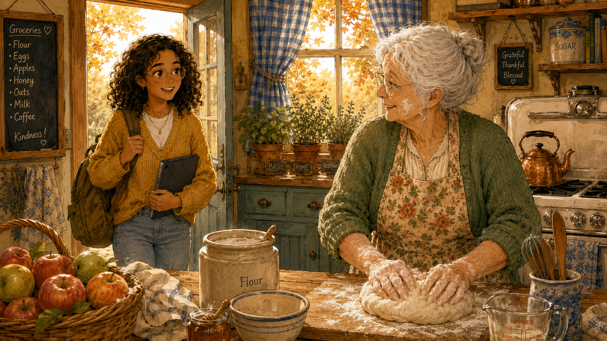

Image Prompt

(This is Panel 1 of 12. Do not include the panel number in the image.)

Wide-landscape 16:9 cozy watercolor illustration. Maya, a 16-year-old mixed-race girl with light brown skin, shoulder-length curly dark brown hair, wire-frame glasses, wearing a mustard-yellow sweater over a white t-shirt and faded jeans, stands in the doorway of a warm farmhouse kitchen holding a backpack over one shoulder and a tablet under her arm. The autumn afternoon light streams through the back window behind her, golden and soft. In the foreground at the kitchen counter, Nana Rose — late seventies, wavy white hair in a soft loose bun, silver wire-rim glasses, sage-green cardigan over a cream blouse with a vintage floral apron — is kneading bread dough on a flour-dusted wooden board. She is turning her head toward Maya with a welcoming smile, flour on her cheek. The kitchen has herbs in clay pots on the windowsill, blue gingham curtains, a vintage cream stove, a copper kettle, a basket of apples on the counter, and a small chalkboard with a handwritten grocery list. Color palette: warm amber, honey gold, sage green, rust orange, soft cream, dusty blue. The composition feels like the start of a conversation — warm, expectant, intimate. At least six specific visual details: flour on Nana's cheek, herb pots, copper kettle, gingham curtains, basket of apples, chalkboard list.

Generate the image immediately without asking clarifying questions.

"I've got an article to explain for class, Nana," Maya said, dropping her backpack by the door. "It's about computers that can teach themselves."

Nana wiped her flour-dusted hands on her apron. "Then you'd better sit down and explain it to me first. If I can follow it, your teacher will be able to follow it."

Maya grinned. That was exactly the deal.

---

## Panel 2 — The Big Question

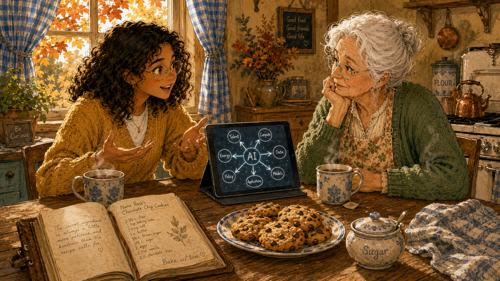

Image Prompt

(This is Panel 2 of 12. Do not include the panel number in the image.)

Wide-landscape 16:9 cozy watercolor illustration. Maya and Nana Rose now sit at the kitchen table across from each other, cups of tea in front of them. Maya leans forward earnestly, hands gesturing as she talks. Nana sits with one elbow on the table, chin in hand, eyebrows slightly raised in skeptical interest. On the table between them sits the tablet showing a simple diagram, a plate of cookies, and the open recipe book. Through the window behind Maya, autumn maple leaves glow rust and gold. Maya wears the mustard-yellow sweater, Nana the sage-green cardigan and floral apron. Maya's face is bright with explanation; Nana's expression says "I've heard this kind of claim before." The lighting is warm late-afternoon honey-gold. Color palette: warm amber, honey gold, sage green, rust orange, soft cream, dusty blue. Specific details: steam rising from tea cups, cookies on a blue-rimmed plate, Nana's silver glasses catching the light, a small ceramic sugar bowl, the wooden grain of the table, autumn leaves out the window.

Generate the image immediately without asking clarifying questions.

"Some people think one company is going to make a computer so smart," Maya said, "that no one else will ever catch up. Like — they pull ahead, and then they just keep pulling ahead, forever."

Nana stirred her tea. "Like Sears used to be? Until it wasn't?"

"That's the question. The article says there are *eight forces* pulling on the answer. Four that speed the leader up. Four that slow the leader down. The winner-takes-all answer depends on which side wins."

"Eight is a lot," Nana said. "Start with one."

---

## Panel 3 — The Sourdough Starter

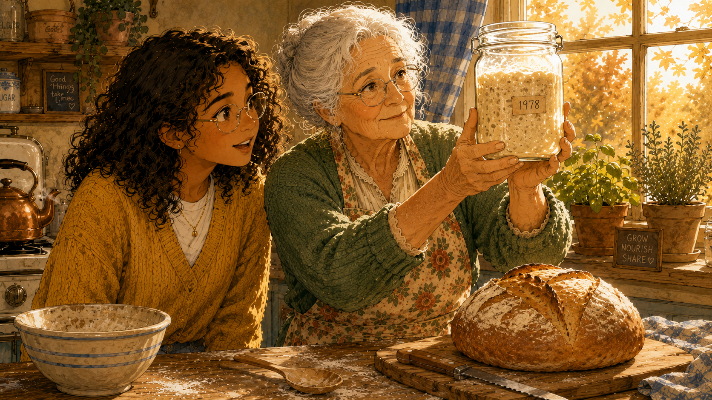

Image Prompt

(This is Panel 3 of 12. Do not include the panel number in the image.)

Wide-landscape 16:9 cozy watercolor illustration. A close-up scene at the kitchen counter. Nana Rose stands at the counter holding up a glass jar of bubbling, lively sourdough starter to the warm window light. Maya stands beside her, looking at the starter with new appreciation. The starter is a creamy beige with visible bubbles, and a faded handwritten label on the jar reads "1978". Behind them on the counter sits a beautiful loaf of golden-crusted sourdough bread on a wooden board. Maya wears the mustard-yellow sweater, Nana the sage-green cardigan and floral apron. The sun catches the jar and makes the bubbles glow. On the wooden counter: scattered flour, a wooden spoon, a small ceramic bowl, the bread loaf, a bread knife. The mood is reverent — both characters are looking at the starter with real attention, as if it's about to teach them something. Color palette: warm amber, honey gold, sage green, rust orange, soft cream, dusty blue. Specific details: bubbles in starter, "1978" label, golden crust on bread, scattered flour, sunlight through jar, wooden spoon.

Generate the image immediately without asking clarifying questions.

"Force number one," Maya said. "The article calls it *recursive self-improvement.* Which is just — the better the AI gets at writing code, the faster it can write the code that makes it even better."

Nana looked at her starter for a long moment. Then she held the jar up to the light.

"Like this," she said. "I started this in 1978. Every loaf I bake makes the starter a little stronger. The stronger starter makes a better loaf. The better loaf gives me more confidence to bake more often. Forty-eight years and it's still getting better."

Maya stared. "Yes. Exactly that."

"Then I already understand the first one. What's the second?"

---

## Panel 4 — The Garden That Tends Itself

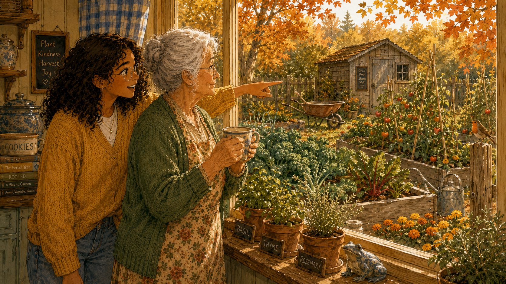

Image Prompt

(This is Panel 4 of 12. Do not include the panel number in the image.)

Wide-landscape 16:9 cozy watercolor illustration. Maya and Nana Rose stand at the kitchen window, looking out at Nana's autumn vegetable garden. The garden is visible through the window: raised wooden beds, tomato vines on stakes still bearing a few last red tomatoes, leafy kale and chard, marigolds along the border, a small wooden shed in the back, a wheelbarrow, a watering can, and a robin perched on a fence post. Maya is gesturing at the garden as she talks; Nana watches the garden with a thoughtful expression, holding her tea. Maya wears the mustard-yellow sweater, Nana the sage-green cardigan and floral apron. The afternoon sun is golden and the garden is bathed in autumn light. Inside on the windowsill: herbs in clay pots, a small ceramic frog. Color palette: warm amber, honey gold, sage green, rust orange, soft cream, dusty blue. Specific details: tomato vines on stakes, kale leaves, marigolds, wheelbarrow, watering can, robin on fence post.

Generate the image immediately without asking clarifying questions.

"The second force is the scary one," Maya said. "Right now, the AI helps the engineers — but the engineers still decide what to try next. Force two is when the AI starts deciding by itself. It runs its own experiments. It picks what to work on. It doesn't need the engineers anymore."

Nana looked out at her garden a long time.

"Like if my garden could decide what to plant in the spring," she said slowly. "And weed itself. And put down its own mulch. I'd just sit on the porch and watch it get better every year, without me."

"Right. And the article says — that's the moment the leader pulls away. Because the leader stops needing humans, and humans are slow."

"Hm," Nana said. "I'd miss the gardening."

---

## Panel 5 — The Patron with the Bigger Oven

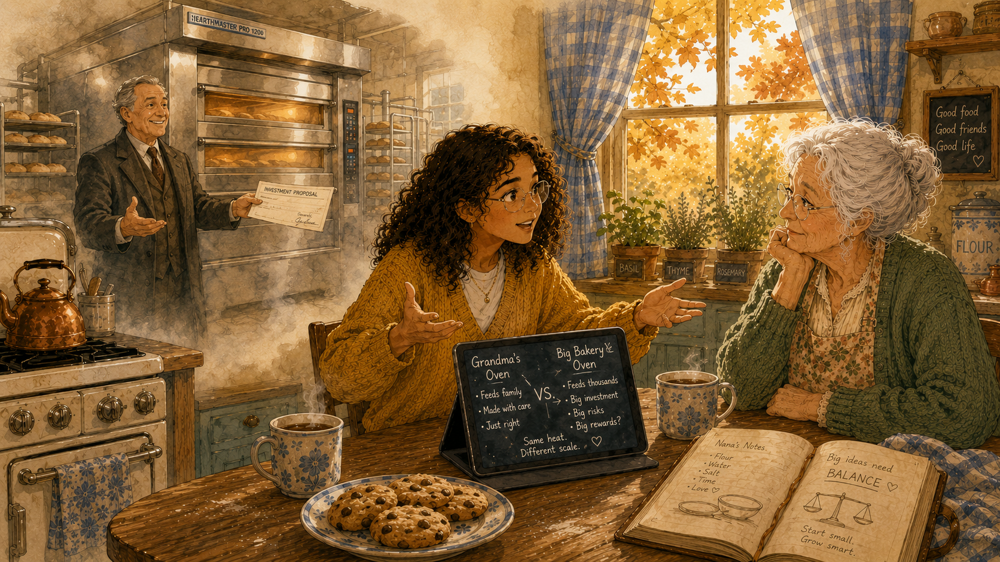

Image Prompt

(This is Panel 5 of 12. Do not include the panel number in the image.)

Wide-landscape 16:9 cozy watercolor illustration. The scene shifts to a slightly imagined view: Maya and Nana sit at the kitchen table, but now we see Nana's vintage cream-colored stove on the left side of the image — and through a gentle dreamlike haze beside it, a much larger commercial bakery oven appears, gleaming stainless steel, four times the size. A well-dressed older gentleman in a wool coat stands beside the larger oven holding a check or contract, gesturing generously. The dreamlike overlay is rendered in a slightly softer wash to show it is imagined, not real. Maya is at the table making the comparison with her hands, Nana watches with raised eyebrows. Maya wears the mustard-yellow sweater, Nana the sage-green cardigan and floral apron. The kitchen elements remain: copper kettle, herb pots, gingham curtains. Color palette: warm amber, honey gold, sage green, rust orange, soft cream, dusty blue, with a soft dreamy haze around the imagined oven. Specific details: vintage cream stove, gleaming commercial oven, wool coat on patron, contract in hand, copper kettle, herb pots.

Generate the image immediately without asking clarifying questions.

"Force three is money," Maya said. "Imagine the bakery down the street had a regular customer — a really rich one — who walked in one day and said, *here's enough money to buy an oven ten times bigger than anyone else's. Don't fall behind.*"

"Mr. Hansen," Nana said immediately. "Old Mr. Hansen on Elm Street did exactly that for the Ukrainian bakery in 1962. They had the only commercial oven in the county for years."

"That's force three. One of the AI companies just got a forty-billion-dollar promise from a partner. Same idea. Now they can buy more of the special chips that make the AI run, and the smaller bakeries can't keep up on oven size alone."

"Forty *billion?*"

"Billion."

Nana whistled. "Mr. Hansen would be impressed."

---

## Panel 6 — The Recipe Book

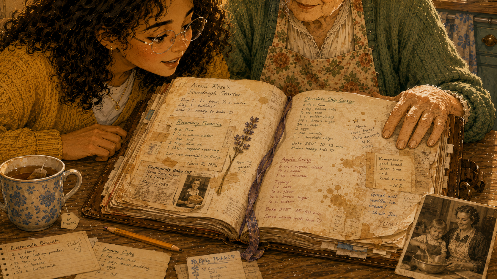

Image Prompt

(This is Panel 6 of 12. Do not include the panel number in the image.)

Wide-landscape 16:9 cozy watercolor illustration. A close-up of Nana's leather-bound recipe book, open on the kitchen table. The pages are densely covered with handwritten recipes in different shades of ink (showing decades of additions), with margin notes, taped-in newspaper clippings, dried flower pressed between pages, splatters from cooking, sticky notes, a lock of ribbon as a bookmark. Maya leans over the book studying the margin notes; Nana stands beside her with one hand resting on the open page, looking at it fondly. Maya wears the mustard-yellow sweater, Nana the sage-green cardigan and floral apron. On the table beside the book: a teacup, a pencil, an old photograph of a younger Nana baking with a small child, scattered loose recipe cards. The lighting is warm and intimate — like looking at something irreplaceable. Color palette: warm amber, honey gold, sage green, rust orange, soft cream, dusty blue. Specific details: different ink colors, taped clippings, pressed flower, splatters, ribbon bookmark, old photograph.

Generate the image immediately without asking clarifying questions.

"Force four is the one I wasn't sure I understood," Maya said. "But then I saw this." She tapped the open recipe book.

"What about it?"

"Anyone could get your recipes. You could photocopy the whole book and hand it out at church. But they wouldn't have *this.*" Maya pointed to a margin note that read *too dry — added 2 tbsp buttermilk, perfect.* And another: *Aunt Edith hated it, everyone else loved it, keep making.* And another: *Christmas 1991, the year of the snowstorm.*

"All these little notes are what actually make your bread *your* bread. The article calls this a *data flywheel.* The big AI companies have millions of people using their AI every day. Every conversation, every correction — those are margin notes. No one else has them. Even with the same recipe, no one else can catch up on the *story.*"

Nana looked at the page for a long moment. "I never thought of these as worth anything."

"They might be the most valuable thing in the kitchen."

---

## Panel 7 — The Size of the Kitchen

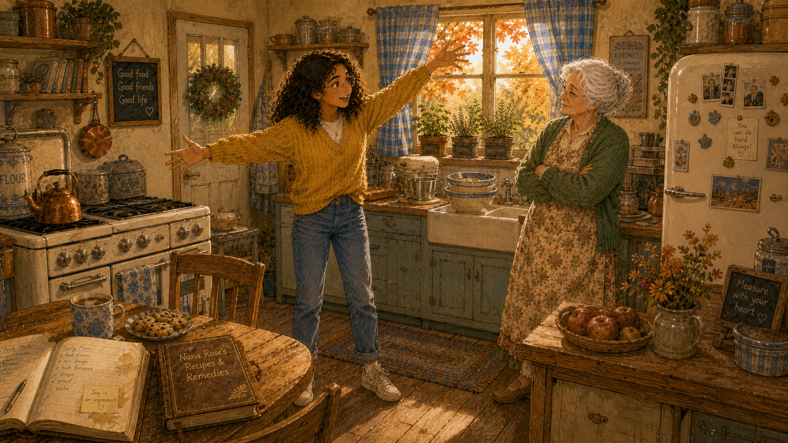

Image Prompt

(This is Panel 7 of 12. Do not include the panel number in the image.)

Wide-landscape 16:9 cozy watercolor illustration. A wider establishing shot of Nana's entire kitchen, showing its actual cozy modest size. Maya stands in the middle gesturing at the walls, ceiling, and floor with a sweeping motion as if to show *this is all there is*. Nana stands by the sink with her arms folded, nodding knowingly. The kitchen is warm and full but clearly small — the vintage cream stove, the wooden farmhouse table, the counter with its appliances, the windowsill herbs, the copper kettle, the fridge with magnets, the chalkboard. There is a slight stack of mixing bowls on the counter as if she's been doing a lot of baking. Through the window the autumn afternoon glows. Maya wears the mustard-yellow sweater, Nana the sage-green cardigan and floral apron. The mood is "yes, but be realistic." Color palette: warm amber, honey gold, sage green, rust orange, soft cream, dusty blue. Specific details: vintage cream stove, farmhouse table, herbs on windowsill, copper kettle, fridge with magnets, chalkboard, stack of mixing bowls.

Generate the image immediately without asking clarifying questions.

"Now the slowing-down forces," Maya said. "Otherwise the bakery would have already won."

Nana folded her arms. "Force number five?"

"The kitchen is only so big. The bakery can buy the biggest oven in the world, but they still need a building to put it in. They need electricity. They need water. They need flour shipped in. Force five is — *the world only has so much of all that.* Even the leader runs out of room."

"My kitchen has the same problem. There's only so much counter space. Doesn't matter how good my recipes are."

"Right. The article calls this the compute constraint. It's the single biggest reason the leader hasn't already won. The world can only build chips and power plants so fast."

"Good," Nana said. "I like force five."

---

## Panel 8 — Tasting Too Many Cookies

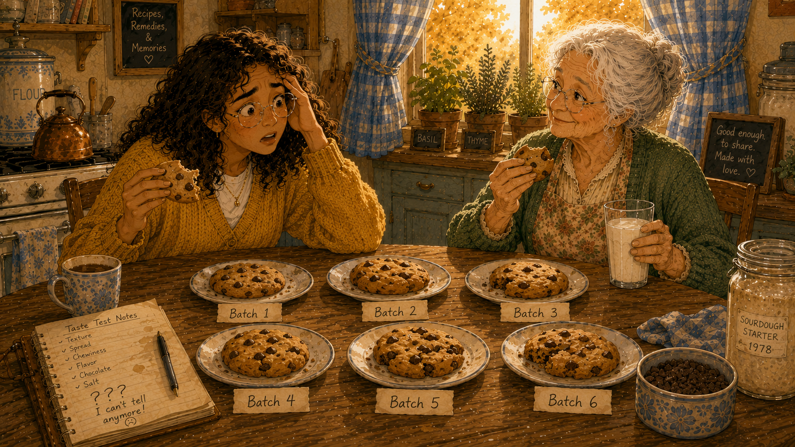

Image Prompt

(This is Panel 8 of 12. Do not include the panel number in the image.)

Wide-landscape 16:9 cozy watercolor illustration. The kitchen table now has SIX different plates, each holding a slightly different chocolate chip cookie — some lighter, some darker, some bigger, some chunkier. Maya sits on one side of the table with a half-eaten cookie in her hand and a slightly overwhelmed expression, looking at the spread of cookies as if she can no longer tell them apart. Nana sits across from her, amused, holding her own cookie and a cup of milk. There are little handwritten labels in front of each cookie ("Batch 1", "Batch 2", "Batch 3", etc.). The mood is warm and slightly comedic — Maya has hit a tasting limit. Maya wears the mustard-yellow sweater, Nana the sage-green cardigan and floral apron. Color palette: warm amber, honey gold, sage green, rust orange, soft cream, dusty blue. Specific details: six plates, six labeled batches, glass of milk, Maya's overwhelmed expression, scattered cookie crumbs, paper labels.

Generate the image immediately without asking clarifying questions.

"Force six. The harder one." Maya picked up a cookie from one of the plates Nana had set out as a teaching aid. "If I asked you to tell me which of these six cookies is the best — really the best — could you?"

Nana looked at the cookies. "After the first three, my mouth gets confused."

"That's force six. The AI gets so good that we can't tell which version is actually better. We run out of ways to test it. The article says — *you cannot improve faster than you can measure improvement.* Even the leader gets stuck waiting for someone to figure out if their new model is actually any better than the old one."

"That sounds like every cookie contest at the church fair," Nana said. "After the third judge, no one is judging anymore. They're just eating cookies."

---

## Panel 9 — The Recipe That Always Leaks

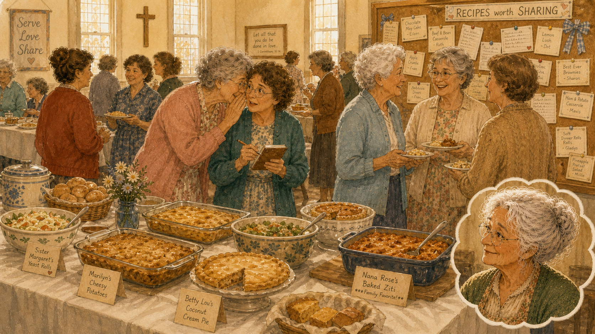

Image Prompt

(This is Panel 9 of 12. Do not include the panel number in the image.)

Wide-landscape 16:9 cozy watercolor illustration. The scene shifts to a memory or imagined view: a church fellowship hall potluck, with long folding tables draped in white tablecloths, covered with casserole dishes, pies, breads, and salads. Several older women in cardigans and dresses stand chatting in small groups, one of them leaning over to another with a knowing whisper, clearly asking for a recipe. One woman has a small notebook out, jotting something down. A cork board on the wall behind them is covered with thumb-tacked recipe cards. The lighting is fluorescent-warm, slightly nostalgic, with afternoon light coming through high church windows. In the lower corner of the image, in a small inset like a memory bubble, Nana Rose appears smiling — she remembers this scene well. Color palette: warm amber, honey gold, sage green, rust orange, soft cream, dusty blue. Specific details: long folding tables, white tablecloths, casserole dishes, recipe cards on cork board, women in cardigans whispering, small notebook, high church windows.

Generate the image immediately without asking clarifying questions.

"Force seven," Maya said. "Recipes always leak."

Nana laughed out loud. "At every potluck. Always."

"Right? Someone always asks *what's in this?* — and within six months, everyone at church has the same banana bread recipe. The article says the same thing happens with AI. People leave one company and go work at another. Papers get published. Tricks get figured out. The leader's secret doesn't stay secret very long."

"Mrs. Petersen tried to keep her pecan pie recipe secret for twenty years," Nana said. "I had it by 1985."

"That's force seven."

---

## Panel 10 — The Everyday Loaf

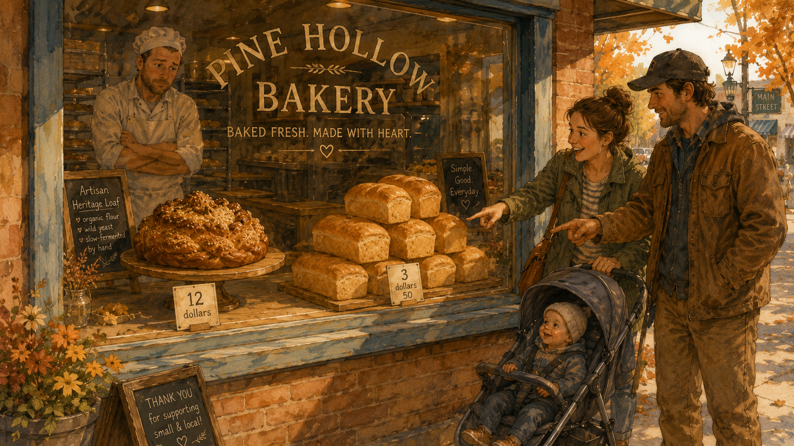

Image Prompt

(This is Panel 10 of 12. Do not include the panel number in the image.)

Wide-landscape 16:9 cozy watercolor illustration. A scene at a small-town bakery storefront window. Behind the glass, on the left side of the display, sits a single ornate, beautiful artisan loaf — braided, dusted with seeds, almost too pretty to eat — with a price tag reading "12 dollars". On the right side of the display sits a stack of simple plain golden loaves with a price tag reading "3 dollars 50". Outside the window, a young mother with a stroller and a young man in work clothes are both pointing at the simple loaves, while no one looks at the fancy one. Through the bakery window we can also faintly see the baker inside, looking proudly at the artisan loaf with a slightly disappointed expression. The mood is gently ironic — the best isn't always what sells. Cozy small-town autumn afternoon lighting. Color palette: warm amber, honey gold, sage green, rust orange, soft cream, dusty blue. Specific details: ornate braided loaf, simple golden loaves, price tags, stroller, work clothes, baker visible inside, bakery window with painted lettering.

Generate the image immediately without asking clarifying questions.

"Force eight is my favorite," Maya said. "The bakery's fanciest, most expensive loaf? It's almost never what sells the most."

Nana nodded. "People want a good loaf for their toast. They don't want to spend twelve dollars on a showpiece."

"That's force eight. The very best AI is too expensive for most people to use every day. So most companies use a cheaper, good-enough one. Which means the leader doesn't get all those everyday users — and remember, those everyday users were force four. The margin notes. Without the everyday users, the leader doesn't even get to fill its recipe book as fast."

"So force eight chokes force four."

Maya blinked. "Nana. That's exactly what the article says. Word for word."

"I bake every day, child. I notice things."

---

## Panel 11 — The Question

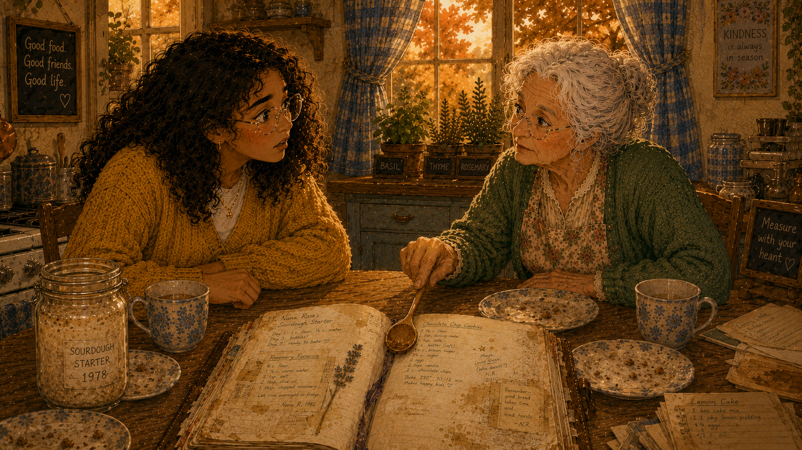

Image Prompt

(This is Panel 11 of 12. Do not include the panel number in the image.)

Wide-landscape 16:9 cozy watercolor illustration. Back at the kitchen table. The afternoon light has shifted to deeper amber — late afternoon now, almost evening. The tea cups are empty. The cookie plates are mostly crumbs. The recipe book is still open. Nana sets down her wooden spoon on the table with a soft, deliberate gesture and leans forward, her sharp blue eyes meeting Maya's directly. Maya has stopped talking and is listening. The whole frame focuses on Nana's question — her face is calm, focused, kind, but it's the face of someone who has just understood something important and is asking the question that matters. Maya's expression is alert, slightly surprised — she didn't expect Nana to cut to the heart of it so fast. Maya wears the mustard-yellow sweater, Nana the sage-green cardigan and floral apron. Color palette: warm amber, honey gold, sage green, rust orange, soft cream, dusty blue, with the deeper rust of late afternoon. Specific details: empty tea cups, cookie crumbs, open recipe book, wooden spoon set down, Nana's direct gaze, Maya's listening posture, deepening light through window.

Generate the image immediately without asking clarifying questions.

Nana set her wooden spoon down on the table.

"Maya. So which side wins? The four that speed it up, or the four that slow it down?"

Maya thought for a long moment. "The article says — neither. Right now, they're roughly balanced. The leader is ahead but not running away. It's like the bakery is doing well, but the other bakeries are still in business."

"Then what's the real question?"

"The real question is whether *force two* — the garden that tends itself — actually starts working. If the AI can really run its own experiments without people, then suddenly all the slowing-down forces stop mattering. Force seven doesn't matter because the leader is moving too fast for anyone to copy. Force five matters less because force three already gave them the biggest oven. Force six is the only one left, and it's not enough."

Nana watched her granddaughter's face.

"So the question," Nana said slowly, "is whether the bakery still needs a baker."

Maya stared at her. "Yes. That's exactly the question."

---

## Panel 12 — The Answer Behind the Question

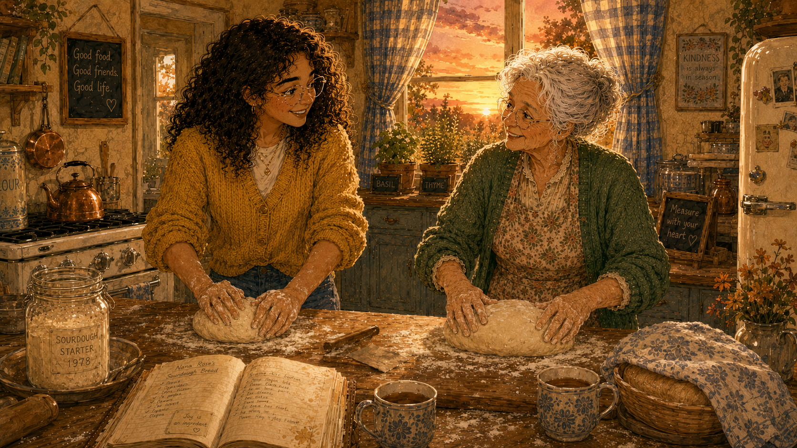

Image Prompt

(This is Panel 12 of 12. Do not include the panel number in the image.)

Wide-landscape 16:9 cozy watercolor illustration. Final scene. Maya and Nana now stand together at the kitchen counter. Nana has her hands buried in fresh bread dough on the floured wooden board, gently shaping a loaf. Maya stands beside her, sleeves now rolled up, also kneading a small ball of dough next to Nana — learning. Both are smiling warmly. Through the window behind them, the autumn sun is setting in golden-pink-amber tones. The kitchen feels warmer than ever. On the counter: flour scattered, the sourdough starter jar, the open recipe book, a loaf already proofing under a tea towel, two mugs of fresh tea. The mood is resolution — the conversation has come full circle, and the answer is in the doing. Maya wears the mustard-yellow sweater with sleeves rolled up, Nana the sage-green cardigan and floral apron. Color palette: warm amber, honey gold, sage green, rust orange, soft cream, dusty blue, with sunset rose and gold through the window. Specific details: flour-dusted board, two pairs of hands kneading dough, sourdough starter jar, recipe book, proofing loaf under tea towel, two fresh mugs of tea, sunset through window.

Generate the image immediately without asking clarifying questions.

Nana pushed the bowl of dough toward Maya and nodded at the second floured board.

"Wash your hands. You can knead while we talk."

Maya rolled up her sleeves. "Why?"

"Because the answer to your question," Nana said, "is the same as the answer to most questions. The bakery will need a baker for as long as bread is for *people.* The day bread stops being for people is the day the bakery stops needing a baker. Until then — every loaf needs hands."

Maya smiled and pressed her thumbs into the dough. "I think I know how I'm going to write this summary now."

"Good," Nana said. "And eat another cookie. You've earned it."

---

## Epilogue: What Maya Learned

| The Article Said | Nana's Kitchen Showed | The Lesson |
|---|---|---|
| Recursive self-improvement (R1) | The sourdough starter that gets stronger with every loaf | Compounding works in any system that loops back on itself |
| Autonomous research (R2) | A garden that tends itself | The system changes character the moment humans drop out of the loop |
| Capital → compute (R3) | Mr. Hansen buying the bakery a bigger oven | Money rewrites the rules for the player it favors |
| Data flywheel (R4) | Decades of margin notes in the recipe book | The story behind the recipe is worth more than the recipe |
| Compute constraint (B1) | The kitchen is only so big | Every system has a physical ceiling |
| Evaluation bottleneck (B2) | Tasting too many cookies | You can't improve faster than you can measure |
| Diffusion (B3) | Recipes always leak at the potluck | Secrets are temporary in any social system |
| Cost-performance friction (B4) | The everyday loaf, not the showpiece | What sells the most is rarely what's the best |

---

## Call to Action

The next time someone tells you a single technology — or a single company — is about to win everything, do what Maya did. Try to explain why to someone who doesn't speak the jargon. If you can't, the story is probably wrong. If you can, you'll find that almost every "winner takes all" prediction has a balancing force someone forgot to mention.

The world is rarely a single loop. It's almost always at least eight.

---

## Quotes from the Conversation

> "Eight is a lot. Start with one."
> — Nana Rose

> "The bakery will need a baker for as long as bread is for *people.*"
> — Nana Rose

> "I think I know how I'm going to write this summary now."
> — Maya

---

## References

1. [Wikipedia: Causal loop diagram](https://en.wikipedia.org/wiki/Causal_loop_diagram) - The systems-thinking notation used in the source article to draw the eight forces
2. [Wikipedia: Reinforcement (system dynamics)](https://en.wikipedia.org/wiki/Positive_feedback) - Background on how reinforcing loops produce exponential or runaway behavior
3. [Wikipedia: Negative feedback](https://en.wikipedia.org/wiki/Negative_feedback) - Background on how balancing loops keep systems in check
4. [Winner Takes All? A Systems View of the AI Race](../../articles/winner-takes-all.md) - The companion article in this textbook with the full causal-loop diagrams and analysis
5. [Donella Meadows: Leverage Points](https://donellameadows.org/archives/leverage-points-places-to-intervene-in-a-system/) - The classic essay on where to intervene in a system, which informs the article's "leverage point" framing
