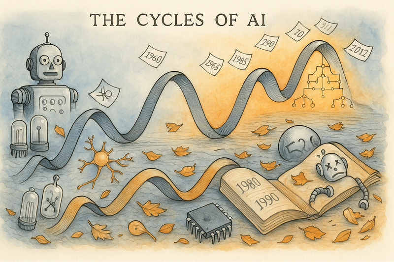
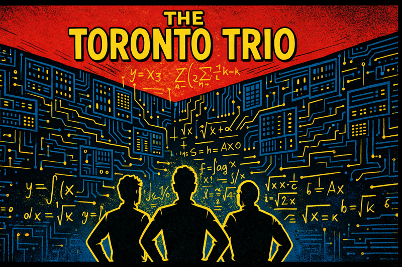
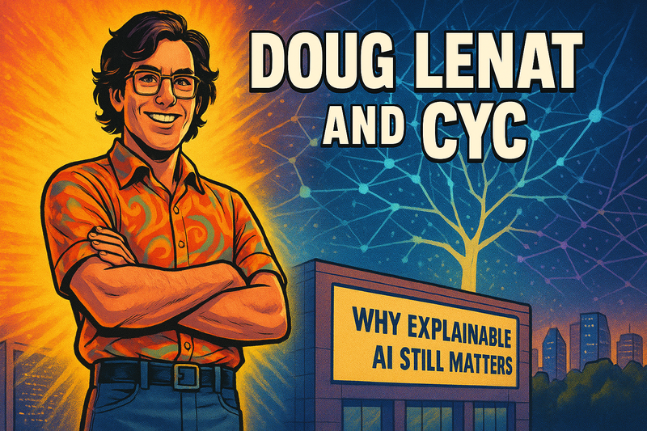
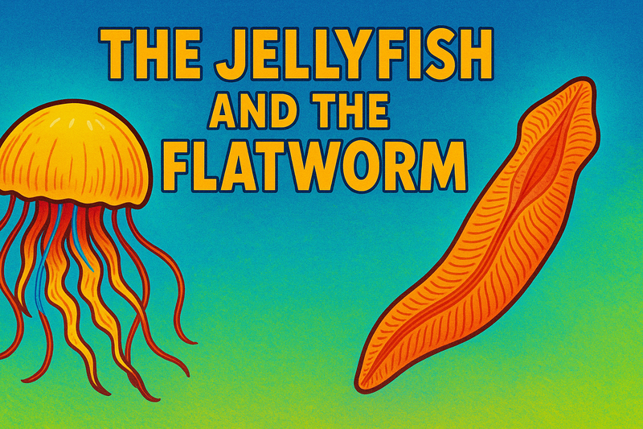
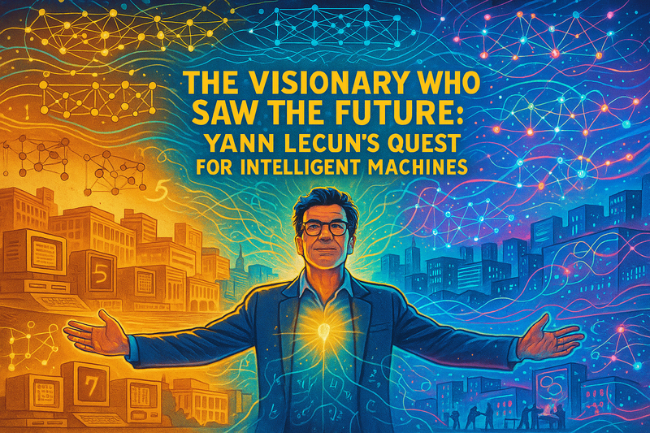
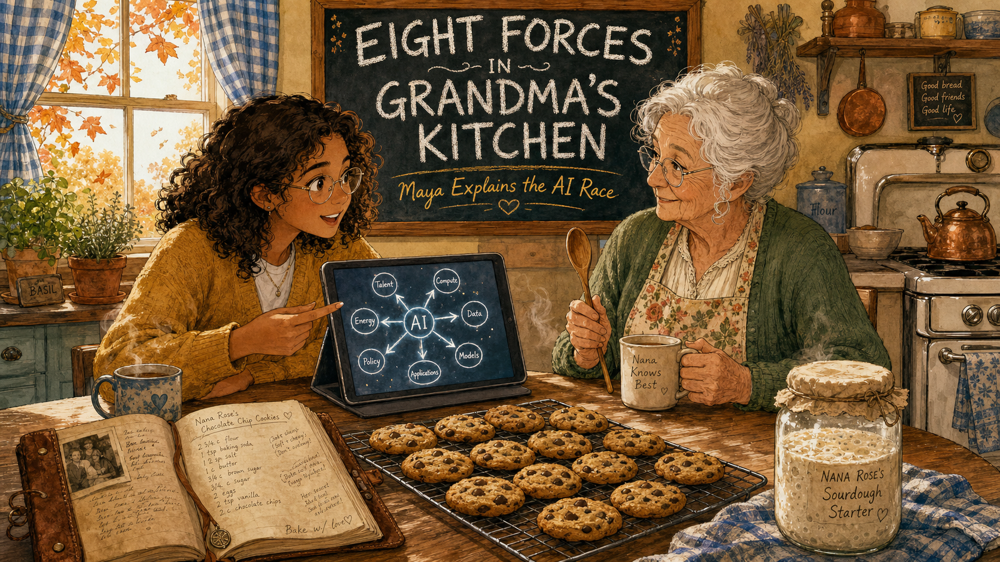

# Tracking AI Stories

-   

    **AI Winters**

    This story tells the story of AI's boom-and-bust cycles from the
    1950s to 2012, chronicling the field's alternating periods of wild optimism
    and crushing disappointment.

    [:octicons-arrow-right-24: Read the AI Winters Story](./ai-winters/index.md)

-   

    **AlexNet**

    In the world of artificial intelligence, there are watershed moments that fundamentally change the course of history. The ImageNet 2012 competition was one such moment.

    [:octicons-arrow-right-24: Read the AlexNet Story](./alexnet/index.md)

-   

    **Doug Lenat and Cyc**

    Doug Lenat was a pioneering AI researcher who spent nearly 40 years (1984-2023) building Cyc, an ambitious project to encode all human common sense into a massive knowledge base.

    [:octicons-arrow-right-24: Read the Doug Lenat Story](./doug-lenat-and-cyc/index.md)

-   

    **The Jellyfish and the Flatworm**

    Approximately 600 million years ago, two very different evolutionary paths emerged in the animal kingdom. These divergent paths offer profound insights about organizational intelligence and AI strategy.

    [:octicons-arrow-right-24: Read the Jellyfish and Flatworm Story](./jellyfish-and-flatworm/index.md)

-   

    **The Yann LeCun Story**

    This story chronicles Yann LeCun's journey from a curious teenager in 1970s Paris to a pioneering AI researcher who revolutionized machine learning with convolutional neural networks.

    [:octicons-arrow-right-24: Read the Yann LeCun Story](./yann-lecun/index.md)

-   

    **Eight Forces in Grandma's Kitchen**

    A high-school student named Maya visits her grandmother on a Saturday afternoon and tries to explain the "winner takes all" AI race using sourdough, gardens, and family recipes. Eight forces pulling on the future of AI, told entirely in kitchen metaphors.

    [:octicons-arrow-right-24: Read Grandma and the AI Race](./grandma-and-the-ai-race/index.md)

