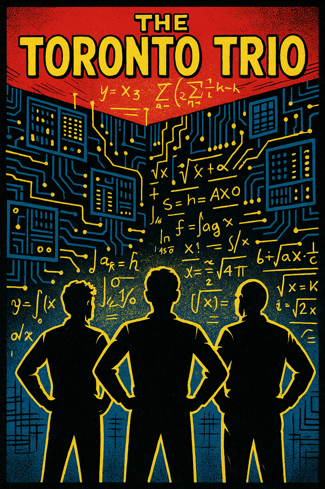
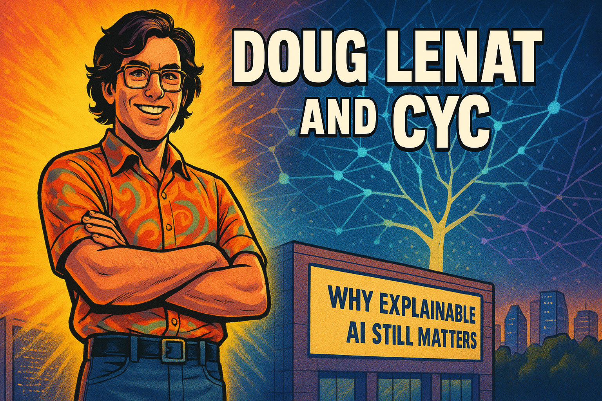

# Tracking AI

## AI Winters
{ width="400pt"}

This story tells the story of AI's boom-and-bust cycles from the
1950s to 2012, chronicling the field's alternating periods of wild optimism
and crushing disappointment. It follows the journey from the 1956 Dartmouth
conference's grand predictions, through two "AI winters" caused by unmet
promises and technical limitations, to brief revivals with expert systems and
machine learning, culminating in AlexNet's 2012 breakthrough that finally
ended the cycle of hype and disappointment forever.
[Read the AI Winters Story](./ai-winters/index.md)

## Alexnet
{ width="400pt"}

In the world of artificial intelligence, there are watershed moments that fundamentally change the course of history. The ImageNet 2012 competition was one such moment, where an unlikely group of researchers staged what would become known as the "deep learning revolution."

[Read the Alexnet Story](./alexnet/index.md)

## Doug Lenat and Cyc
{ width="400pt"}

Doug Lenat was a pioneering AI researcher who spent nearly 40 years (1984-2023) building Cyc, an ambitious project to encode all human common sense into a massive knowledge base using symbolic logic and hand-crafted rules. Despite initial successes with his earlier programs AM and EURISKO in the 1970s, and despite repeatedly promising that Cyc would achieve human-level reasoning "within 10 years," the system grew increasingly complex and unwieldy, requiring years of training for engineers to make even simple updates. While Lenat and his team at Cycorp painstakingly encoded millions of logical rules teaching Cyc facts like "water is wet," the AI field was revolutionized by deep learning neural networks in the 2010s, which achieved superior performance in language understanding, image recognition, and reasoning without any hand-coded rules—accomplishing in a few years what Cyc couldn't achieve in decades. Until his death in August 2023, Lenat remained convinced that true AI required symbolic reasoning and explainability, arguing that neural networks were merely sophisticated pattern matchers, not genuine intelligence. Though his approach was ultimately overshadowed, his fundamental questions about machine understanding, reasoning, and explainability remain central challenges in AI today, suggesting he may have been asking the right questions at the wrong time in history.

## The Jellyfish and the Flatworm Story
]{ width="400pt"}

Approximately 600 million years ago, two very different evolutionary paths emerged in the animal kingdom. These divergent paths offer profound insights not just about biological evolution, but about organizational intelligence and AI strategy in our modern world.
This story is a metaphor for how intelligence must evolve in some organizational in order to survive.

[Read The Jellyfish and the Flatworm Story](./jellyfish-and-flatworm/index.md)

## The Yann LeCun Story
{ width="400pt"}

This story chronicles Yann LeCun's journey from a curious teenager in 1970s Paris to a pioneering AI researcher who revolutionized machine learning. It follows his development of convolutional neural networks (CNNs) at AT&T Bell Labs for optical character recognition, his forward-thinking establishment of the NYU Center for Data Science in 2012, and his collaboration in founding ICLR to unite the field. The narrative culminates with his 2019 Turing Award and explores his thoughtful skepticism about achieving AGI through large language models alone, emphasizing his belief that future AI systems need comprehensive world models to achieve true intelligence. Throughout, the story illustrates how LeCun combined deep technical innovation with visionary leadership to challenge the status quo and transform what was possible in artificial intelligence.

[Read the Yann LeCun Story](./yann-lecun/index.md)