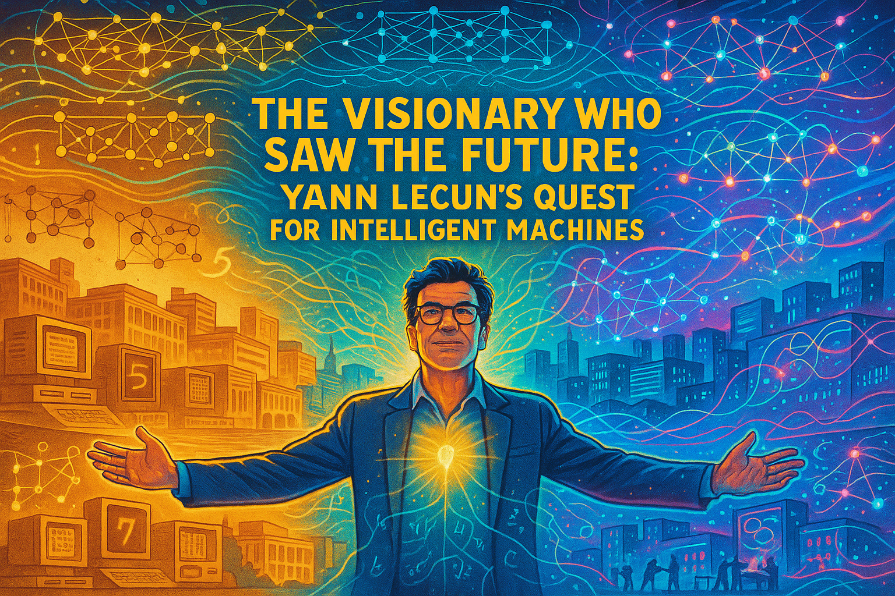

# Tracking AI

## Yann LeCun
{ width="400pt"}

This story chronicles Yann LeCun's journey from a curious teenager in 1970s Paris to a pioneering AI researcher who revolutionized machine learning. It follows his development of convolutional neural networks (CNNs) at AT&T Bell Labs for optical character recognition, his forward-thinking establishment of the NYU Center for Data Science in 2012, and his collaboration in founding ICLR to unite the field. The narrative culminates with his 2019 Turing Award and explores his thoughtful skepticism about achieving AGI through large language models alone, emphasizing his belief that future AI systems need comprehensive world models to achieve true intelligence. Throughout, the story illustrates how LeCun combined deep technical innovation with visionary leadership to challenge the status quo and transform what was possible in artificial intelligence.

[Read the Yann LeCun Story](./yann-lecun/index.md)