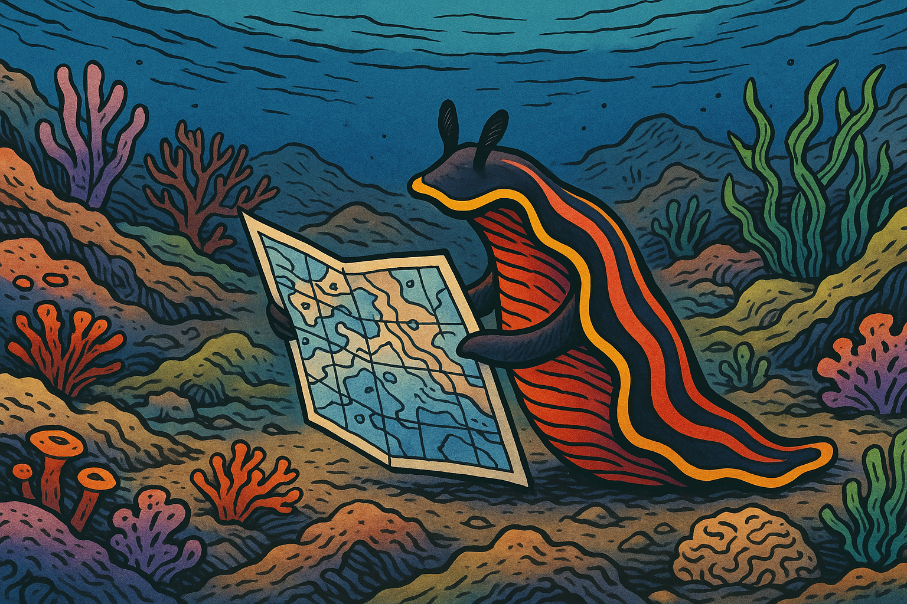

# The Jellyfish and the Flatworm: A Story of Evolution

Approximately 600 million years ago, two very different evolutionary paths emerged in the animal kingdom. These divergent paths offer profound insights not just about biological evolution, but about organizational intelligence and AI strategy in our modern world.
This story is a model for how organizational intelligence is evolving.

## Consider the Jellyfish

    
Image Prompt

Please generate colorful a wide-landscape drawing as though it might appear in a graphic novel.
The image is an underwater drawing of purple and pink jellyfish floating in the open ocean.  The water is a deep blue color.  The jellyfish glow with brilliance.  There are various sizes of jellyfish floating at different depths.

The jellyfish represents one of Earth's earliest evolutionary strategies for survival. These elegant creatures drift through the open ocean, a relatively simple environment with few structural barriers. They possess a decentralized nervous system that requires minimal energy to operate - a perfect adaptation for their lifestyle.

    
Image Prompt

Please generate a colorful a wide-landscape drawing as though it might appear in a graphic novel.

The image must have a consistent style of an underwater drawing of purple and pink jellyfish floating in the open ocean.  The water is a deep blue color.  The jellyfish glow with brilliance.  There are various sizes of jellyfish floating at different depths, but you focus on one big jellyfish in the center of the image.  In this image, a bright yellow fish is caught in the tentacles of the cental jellyfish.

Jellyfish don't actively hunt. Instead, they float passively through the waters, using simple rules to navigate toward food-rich areas and away from predators. Their tentacles wait for prey to drift into them - no complex decision-making required.

The survival strategy of the Jellyfish is beautifully efficient. By avoiding the energy cost of a centralized brain, jellyfish can thrive in nutrient-poor environments. When a small fish becomes entangled in their tentacles, they can feed without needing to plan, strategize, or remember complex patterns.

This simple, rule-based approach to intelligence was perfectly adequate for the jellyfish's environmental niche. But not all environments remained so simple.

## The Flatworm

    
Image Prompt

Panel 3: The flatworm.

Please generate a colorful a wide-landscape drawing as though it might appear in a graphic novel.  Make the style of drawing consistent with the previous drawings.

In this drawing, we see a colorful flatworm crawling along the bottom of the ocean.  The environment is complex with different slopes and rocks. It full of colorful life like coral, amoeba, and seaweed and with several paths around the terrain.

On the complex ocean floor, a different evolutionary strategy emerged. Flatworms were among the first animals to develop a centralized nervous system - a proto-brain that could process and integrate information from multiple sensory inputs.
Unlike the drifting jellyfish, flatworms actively navigate through a structured environment filled with obstacles, hiding places, and varying terrain. This locomotion presented new challenges that required new solutions.

    
Image Prompt

    Generate an image of the flatworm reading a map on the ocean floor.

Flatworms needed to understand the structure of their environment and remember it. They evolved what we might consider the earliest "world models" - internal representations of their surroundings that helped them locate prey, avoid predators, and navigate complex terrain.

These internal representations of their world were like maps.  And these maps provided a competitive advantage. A flatworm with a more accurate model of its environment would find more food, avoid more dangers, and ultimately produce more offspring than its less perceptive relatives.

## The Jellyfish and the Flatworm

    
Image Prompt

    Generate a side-by-side infographic style comparison of the jellyfish on the left and the flatwork on the right.

The fundamental difference between these two evolutionary approaches comes down to environmental complexity and movement.

Jellyfish thrive in open waters where simple rules suffice. Their simple nervous system of about 8,000 neurons is energy-efficient but limited in capability. They react to their environment but don't need to model it.

In contrast, Flatworms navigating the complex topography of the ocean floor, evolved centralized processing and environmental modeling. They needed to understand the structure around them and predict how their movements would interact with that structure.
This divergence teaches us a profound lesson about the relationship between intelligence and environment: the complexity of an organism's cognitive systems must match the complexity of the environment it navigates.

Now let's see how we can use these models to decide what types of intelligence your organization needs to survive.

## Mark's Barbershop

    
Image Prompt

Title: Mark's Barbershop

Please generate a colorful a wide-landscape drawing as though it might appear in a graphic novel.  Make the style of drawing consistent with the previous drawings.

In this drawing we see an interior image of Mark the barber cutting hair in a small twon barbershop.  Outside the window you see a simple scene from a small rural farming  town in the midwest.  The interior of the barbershop is simple with only the tools of a barber and an old-style cash register.  Mark is happy and he is cutting the hair of a teen-age boy in the barber's chair.  The boy is also smiling.  The drawing depicts a simple life in the style of Norman Rockwell.

Consider Mark's Barbershop - a simple business in a small town. Like the jellyfish, Mark operates in a relatively simple environment. He provides one primary service (haircuts), serves a stable local clientele, and faces little competition.

Mark doesn't need complex systems to track customer preferences, analyze market trends, or model competitive responses. His business can thrive with simple record-keeping and personal relationships. Mark's Barbershop is a "jellyfish business" - efficiently adapted to a stable, uncomplicated environment.

## The Old School

    
Image Prompt

Please generate a colorful a wide-landscape drawing as though it might appear in a graphic novel.  Make the style of drawing consistent with the previous drawings.

In this image, create an interior image of Sue the teacher in a very old schoolhouse with a simple interior.  It is a single room schoolhouse in a rural farming village.  Their is a single chalk board at the front of the room.  Sue is giving a very boring lecture on multiplication tables.  The students are board and not paying attention to her.  There are old textbooks covered with dust.  It looks like things have not changed for the past 100 years.

Traditional education often followed a similar "jellyfish model" - a static environment with predictable patterns. In the old schoolhouse, Sue teaches multiplication tables the same way they've been taught for generations. Information flows in one direction, and there's little need to adapt to individual students' needs or learning preferences.
This approach worked in a world where educational demands remained constant over decades. The simple model was sufficient when both the knowledge being transmitted and the methods for transmission rarely changed.

## The New School

    
Image Prompt

Title: The Ultra-Modern AI School

Please generate a colorful a wide-landscape drawing as though it might appear in a graphic novel.  Make the style of drawing consistent with the previous drawings.

The drawing shows an colorful ultra-modern school room in a futuristic setting.  Students are engaged in various project-based learning building a variety of types of robots and AI.  The instructor is a young back woman that is helping debug the code of one of the robots with one students.  The students come from a wide variety of races and gender.  The kids are are all happy, curious and engaged.  The school has huge bright windows overlooking a modern cityscape.  Some of the kids wear rainbow-themed shirts.

Modern education exists in a fundamentally different environment - one that much more closely resembles the complex terrain navigated by flatworms. The modern classroom must adapt to diverse learning styles, integrate rapidly evolving technology, and prepare students for jobs that don't yet exist.

In this complex, dynamic environment, educators need sophisticated "world models" to succeed. They must understand the interconnections between concepts, track individual student progress, and adapt teaching methods to optimize learning outcomes. The modern school is a "flatworm organization" - it requires centralized intelligence and structured knowledge to navigate its complex environment.

## Simple Model

 
Image Prompt

 A very basic data model showing a primitive learning management system with just two tables.  One table is for courses and the other is for students.
 The table for courses just shows instances of the courses of a school: pre-algebra, algebra, geometry, trigonometry etc.
 The second table has three columns for student, date and grade.

The simple data model shown here represents a "jellyfish approach" to educational management - flat tables with minimal structure. Each course exists as an isolated entity, and student information is tracked in the most basic way.

This model might be adequate for a small, unchanging educational environment, but it lacks the capability to represent complex relationships or adapt to changing conditions. Like the jellyfish's nervous system, it's efficient but limited.

## Modern LMS

 
Image Prompt

 Show a graph data model for a very, very complex school. Put "Student" at the center but then put many items like "Course", "Lesson Plan", "Learning Path", "Recommendation", "Student Preferences", "Concept", "Similarity", "Teacher", "Mentor" etc.

The knowledge graph approach represents true "flatworm intelligence" for educational organizations. By modeling the rich interconnections between students, courses, concepts, learning pathways, and preferences, this approach creates a structural representation that mirrors the complexity of modern education.
This model can answer sophisticated questions: What concepts does this student struggle with? Which learning paths lead to the best outcomes for different learning styles? How do various concepts connect to one another?
Just as the flatworm's centralized nervous system allowed it to thrive in complex environments, knowledge graphs enable organizations to navigate complexity with precision and adaptability.

The lesson for modern organizations is clear: simple, rule-based systems (like those used by jellyfish) work well in stable, unstructured environments. But in complex, structured environments that require strategic navigation, we need sophisticated world models that can represent relationships, structure, and interdependencies.

As artificial intelligence evolves, the most powerful systems will combine the pattern-recognition capabilities of large language models with the structured world-modeling of knowledge graphs and the reference frames that human brains use to understand their environment. Organizations that recognize which type of intelligence their environment demands - jellyfish or flatworm - will make better strategic decisions about their AI investments and capabilities.