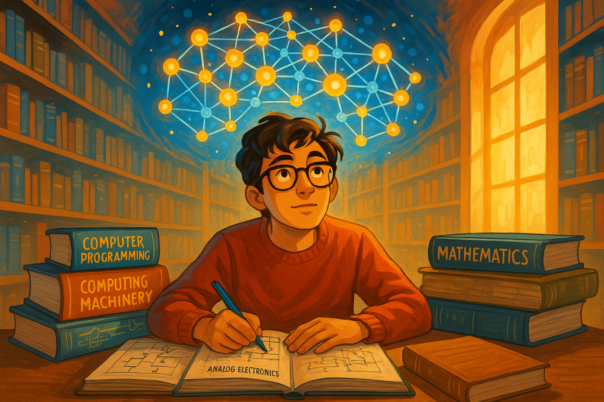

# The Visionary who Saw the Future: Yann LeCun's Quest for Intelligent Machines

Show Image Prompt

Cover Image:
Create a vibrant, tech-optimistic wide-landscape graphic novel cover featuring Yann LeCun as the central figure, depicted in a heroic pose with his arms outstretched toward twin horizons representing past and future. The left horizon shows early computing (1970s-1980s) with vintage computers, handwritten digits, and primitive neural network diagrams, rendered in warm sepia tones. The right horizon explodes with modern AI technology - glowing neural networks, holographic data streams, and interconnected global nodes, rendered in brilliant cyans, magentas, and electric blues.

Behind LeCun, create a dramatic split background where the upper half shows the physical world with realistic buildings, labs, and libraries, while the lower half reveals the digital realm of mathematical concepts materialized as floating equations, converging networks, and architectural visualizations of CNNs. These two realms should blend seamlessly through LeCun's silhouette, with light streaming from his head and heart to represent the flow of ideas.

Above the scene, incorporate three distinct layers: the bottom layer shows early perceptrons and simple neural networks, the middle layer displays complex CNN architectures, and the top layer hints at future world models with intricate cause-and-effect relationships. Use flowing energy lines and glowing nodes to connect these layers, suggesting evolution and continuity.
The title 'THE VISIONARY WHO SAW THE FUTURE: YANN LECUN'S QUEST FOR INTELLIGENT MACHINES' should be integrated organically into the design, perhaps formed by neural pathways or data streams. Use a bold, modern typeface that complements the tech-forward aesthetic.

The overall color palette should be bright and optimistic, featuring deep blues for computational elements, warm golds for human insight and eureka moments, vibrant greens for growth and innovation, and luminous whites for breakthrough moments. The style should blend technical accuracy with artistic interpretation, making complex AI concepts visually accessible and inspiring.

Include subtle Easter eggs like the iconic handwritten '5' and '7' digits from his early work, equations floating in the background, and miniature depictions of key moments from his career. The composition should draw the reader's eye in a circular motion, starting from LeCun's determined expression, sweeping through the technological landscape, and returning to his visionary gaze toward the future.

The entire image must be rendered in a wide-landscape format suitable for a graphic novel cover, with dramatic lighting that emphasizes the contrast between challenges overcome and possibilities ahead.

Show Narrative Prompt

Please create a detailed fun and entertaining story for high-school students about the AI researcher Yann LeCun.  Generate a narrative text but also create detailed descriptions of graph-novel panels that can be inserted into the story at appropriate places.  The theme of the story is how LeCun challenged the status quo and has overcome obstacles in his career by combining both a deep technical understanding and leadership skills.

Tell how in 1988, LeCun joined the Adaptive Systems Research Department at AT&T Bell Laboratories in Holmdel, New Jersey and worked on machine learning.

Give a detailed background of how his career started doing optical character recognition and computer vision using convolutional neural networks (CNNs).

Tell how in 2012, he became the founding director of the NYU Center for Data Science, before the term "Data Science" was popular.

Tell how it 2013, he and Yoshua Bengio co-founded the International Conference on Learning Representations to promote good research in the field of machine learning.

Tell how in March 2019, LeCun won the 2018 Turing Award, sharing it with Yoshua Bengio and Geoffrey Hinton.

Tell how LeCun is extremely skeptical that LLMs alone will ever achieve levels of artificial general intelligence (AGI).  Discuss how LeCun feels that precise world models must be used to achieve AGI.

Our goal is to have you generate the full text of the story, but to turn the story into a graphic novel with many illustrations that explains the arc of  LeCun career. 

When appropriate, suggest an image that could be inserted into the story to make the story a graphic novel. 

Describe each image in detail and be consistent across all the images in the story for style. When you describe an image, make sure to mention that it should be a colorful, bright wide-landscape drawing suitable for technology-forward optimistic graphic-novel.

## Prologue: The Dreamer

Show Image Prompt

Image 1: A colorful, bright wide-landscape drawing showing a young Yann LeCun as a teenager in France, sitting in a library surrounded by dusty books on mathematics and computing. The scene should be split between the physical reality showing him studying analog electronics and computing manuals, and a dreamy overlay showing his imagination of neural networks as glowing interconnected nodes floating above his head. The style should be vibrant and optimistic, with warm lighting streaming through library windows.

In the early 1970s, while most teenagers dreamed of rock concerts and fast cars, young Yann LeCun spent his evenings in the local library in suburban Paris, devouring books on mathematics, computer science, and the emerging field of artificial intelligence. His friends thought he was eccentric – who dreams of teaching machines to think? But Yann's vision was clear: machines could learn like humans do, through observation and experience.

## Chapter 1: Bell Labs: The Spark of Innovation

Show Image Prompt

Please create a new version of [this image](./holmdell-1980.jpeg) using a drawing that might appear in a colorful bright graphic novel. 

In 1988, LeCun joined the legendary AT&T Bell Laboratories in Holmdel New Jersey were over 6,000 engineers and researchers did some of the most groundbreaking research in computer science.

Show Image Prompt

Image 2:
Please generate a new drawing.  It is a wide-landscape drawing that might appear in a graphic novel. 
A tech-optimistic graphic novel panel showing LeCun as a young researcher at AT&T Bell Labs in 1988, working late at night surrounded by early computers and neural network diagrams on whiteboards. The scene should depict him animated and excited, gesturing toward holographic representations of digits floating above a primitive neural network diagram. The setting should have the warm orange glow of desk lamps and the blue light of computer monitors, creating an atmosphere of discovery.

Holmdel was a place where innovation flowed like electricity through the halls. While others worked on traditional software, LeCun's office became a laboratory of the future. His colleagues often found him staring intently at a screen filled with handwritten digits, muttering about "convolutional filters" and "local receptive fields." 

"Why are you trying to reinvent image recognition?" his skeptical colleagues would ask. "Rule-based systems work just fine for reading zip codes."

But LeCun had a vision that others couldn't yet see.

## Chapter 2: The Convolutional Revolution

Show Image Prompt

Image 3: 
Please generate a new drawing.  It is a wide-landscape drawing that might appear in a graphic novel. 
A dynamic wide-landscape illustration showing the inner workings of a CNN processing handwritten digits. The scene should be depicted as an ethereal journey through multiple layers of convolution, showing the transition from raw pixels to abstract features. Use flowing, interconnected neural pathways with bright colors – blues for initial features, transitioning to greens for edges, yellows for shapes, and reds for final classification. The style should be both technical and artistic, making neural network concepts visually beautiful.

Working late into countless nights, LeCun developed something revolutionary: convolutional neural networks (CNNs). While traditional neural networks struggled with images, treating each pixel independently, LeCun's CNNs understood that images had structure – edges, corners, shapes that mattered.

His breakthrough came when his CNN successfully read handwritten digits on checks. The system learned to recognize numbers the way humans do – by understanding patterns and structures, not by memorizing every possible variation. AT&T saved millions of dollars with this technology, but LeCun knew this was just the beginning.

Show Image Prompt

Image 4: 
Please generate a new drawing.  It is a wide-landscape drawing that might appear in a graphic novel. 

A triumphant scene in a bank processing center, split between the mundane reality of workers manually sorting checks and the futuristic overlay of LeCun's CNN system automatically reading and processing thousands of checks with glowing accuracy indicators. The style should contrast the gray, tedious manual work with the vibrant, efficient automated system powered by neural networks.

## Chapter 3: The Data Science Pioneer

Show Image Prompt

Please generate a new drawing.  It is a wide-landscape drawing that might appear in a graphic novel. 

Image 5: A colorful wide-landscape showing the inauguration of the NYU Center for Data Science in 2012. The scene should depict LeCun on stage, but instead of a traditional podium, he's surrounded by floating holographic data visualizations, neural networks, and equations. In the audience, show a mix of excited students and skeptical faculty members, with some thinking "Data Science? That's not a real field!" The setting should feel like a tech startup meets academic institution, with modern architecture and vibrant colors.

By 2012, LeCun was ready for his next challenge. When offered a position at NYU, he didn't just join – he created something entirely new: the Center for Data Science. Many academics scoffed. "Data Science? That's just statistics with a fancy name!"

But LeCun saw the future clearly. Data was becoming the world's most valuable resource, and the techniques he'd been developing could unlock its secrets. Under his leadership, the center became a magnet for brilliant minds from computer science, statistics, and engineering. Together, they pioneered the field that would soon take the world by storm.

## Chapter 4: Building Bridges

Show Image Prompt

Please generate a new drawing.  It is a wide-landscape drawing that might appear in a graphic novel. 

Image 6: A conference room scene showing the first International Conference on Learning Representations (ICLR) in 2013. The panel should show LeCun and Yoshua Bengio planting seeds that grow into a massive tree of knowledge, with branches reaching out to connect researchers worldwide. Each connection should be represented by glowing lines forming a global network of innovation. The style should be aspirational and forward-thinking, with a global map in the background showing research nodes lighting up across continents.

In 2013, LeCun and his longtime collaborator Yoshua Bengio faced another challenge: the field of machine learning was fragmented, with researchers working in isolation. They founded the International Conference on Learning Representations (ICLR), creating a space where ideas could flow freely.

"We need to build bridges, not walls," LeCun declared at the first conference. His vision was simple but powerful: share knowledge openly, challenge each other's ideas, and accelerate progress for everyone.

## Chapter 5: The Turing Triumph

Show Image Prompt

Image 7:
Please generate a new drawing.  It is a wide-landscape drawing that might appear in a graphic novel. 
A spectacular wide-landscape showing the 2019 Turing Award ceremony with LeCun, Bengio, and Hinton standing together. Instead of just receiving medals, they should be depicted as knights of the digital realm, with data streams and neural networks forming crowns above their heads. The scene should be celebratory with confetti, but also symbolic – showing how their work has literally reshaped the world, with elements of their innovations (CNNs, deep learning, AI applications) transforming the environment around them.

March 2019 brought the ultimate recognition: the Turing Award, computing's highest honor. LeCun shared this prestigious award with Yoshua Bengio and Geoffrey Hinton – three pioneers who had persevered through decades of skepticism to revolutionize artificial intelligence.

At the ceremony, LeCun spoke not just about past achievements, but about future challenges. "This is not the end," he declared. "This is just the beginning of our understanding of intelligence."

## Chapter 6: The AGI Skeptic

Show Image Prompt

Image 8:
Please generate a new drawing.  It is a wide-landscape drawing that might appear in a graphic novel. 

A thought-provoking wide-landscape showing LeCun in his office, surrounded by whiteboards filled with diagrams. On one side, show simplified representations of LLMs (depicted as pattern-matching machines), and on the other side, show his vision of world models as complex, interconnected systems. The scene should include holographic projections of physical simulations, cause-and-effect relationships, and reasoning engines. The contrast should be clear but non-judgmental, emphasizing the complementary nature of different AI approaches.

While the world celebrated the rise of large language models (LLMs) like ChatGPT, LeCun remained thoughtfully skeptical. "Language models are impressive, but they're not enough for true intelligence," he would explain to packed auditoriums.

His vision went deeper: machines needed to understand the world, not just predict text. They needed world models – internal representations of how things work, what causes what, and how to reason about unseen situations. This wasn't criticism for its own sake; this was the perspective of someone who had seen the field evolve and knew there were greater heights to reach.

Show Image Prompt

Image 9: 
Please generate a new drawing.  It is a wide-landscape drawing that might appear in a graphic novel. 
A visionary scene showing LeCun's concept of future AI systems. The panel should illustrate a split reality: above, current AI systems performing specific tasks (language, image recognition, etc.), and below, an integrated AI system with a comprehensive world model. This lower level should be depicted as a sophisticated machine understanding the physical world, social dynamics, causal relationships, and abstract reasoning – all connected in a harmonious, glowing network of understanding.

Yann's vision is an AI system that mimics regions of the human brain.  At the center of this is models of the real world.  LLMs are good models of language, but they are not precise models of the world.

## Epilogue: The Continuing Quest

Show Image Prompt

Image 10: 
Please generate a new drawing.  It is a wide-landscape drawing that might appear in a graphic novel. 
A forward-looking wide-landscape that serves as the story's finale. Show LeCun as an elder statesman of AI, but still actively working and mentoring young researchers. The scene should be set in a futuristic lab where his influence is visible everywhere – from CNNs processing visual data to young scientists working on world models and next-generation AI. The atmosphere should be optimistic and inclusive, showing a diverse group of researchers continuing his legacy of challenging assumptions and pushing boundaries.

Today, Yann LeCun continues his quest for truly intelligent machines. His journey from a curious teenager in Paris to a pioneering force in artificial intelligence shows that the greatest obstacles to progress are often our own preconceptions. By combining deep technical understanding with visionary leadership, he didn't just overcome challenges – he redefined what was possible.

As he likes to say, "The best way to predict the future is to create it." And for Yann LeCun, the future of artificial intelligence is still being written.

---

Show Image Prompt

Image 11: 
Please generate a new drawing.  It is a wide-landscape drawing that might appear in a graphic novel. 
A symbolic closing panel showing hands passing a torch between generations of AI researchers. In the background, the evolution of neural networks can be seen as a spiral timeline, from simple perceptrons to modern CNNs to future world models. The torch itself should be rendered as a glowing neural network, symbolizing the continuous flow of knowledge and innovation. The style should be hopeful and inspiring, suggesting that the story continues with each new generation of researchers.

## References

Here are the references reformatted:

1. [Yann LeCun Personal Website](http://yann.lecun.com/)
1.  [Gradient-based learning applied to document recognition](hhttp://vision.stanford.edu/cs598_spring07/papers/Lecun98.pdf) - 1998 - Proceedings of the IEEE - LeCun's seminal CNN paper describing implementation at AT&T Bell Labs
2.  [MNIST Database of Handwritten Digits](http://yann.lecun.com/exdb/mnist/) - 2010 (Updated) - Online Database - Original dataset created from Bell Labs work on postal code recognition
3.  [Handwritten Digit Recognition with a Back-Propagation Network](http://yann.lecun.com/exdb/publis/pdf/lecun-90c.pdf) - 1990 - Advances in Neural Information Processing Systems - Early AT&T Bell Labs application work
4.  [ACM Turing Award Winners](https://amturing.acm.org/award_winners/lecun_1576916.cfm) - 2019 - ACM Official Page - Official announcement of 2018 Turing Award to LeCun, Bengio, and Hinton
5.  [NYU Center for Data Science Launch](https://cds.nyu.edu/about/) - 2012 - NYU Official Page - Founding of center with LeCun as inaugural director
6.  [ICLR Conference History](https://iclr.cc/About) - 2013 - ICLR Official Website - Co-founded by LeCun and Bengio as premier ML conference
7.  [LeCun's NYU Profile](https://cs.nyu.edu/~yann/) - Current - NYU CS Department - Official position at NYU and CV
8.  [LeCun on AI and World Models](https://www.technologyreview.com/2022/03/25/1048261/yann-lecun-meta-ai-large-language-models-agi/) - 2022 - MIT Technology Review - Recent interview on LLM limitations and AGI
9.  [Facebook AI Research Appointment](https://research.facebook.com/blog/2013/12/facebook-ai-lab-new-york-is-hiring/) - 2013 - Meta Research Blog - Announcement of LeCun as FAIR director at Meta
10.  [LeCun at Bell Labs Research](https://www.alcatel-lucent.com/bell-labs-history) - 1988-2003 - Bell Labs Archives - Documentation of LeCun's tenure and achievements at AT&T Bell Labs